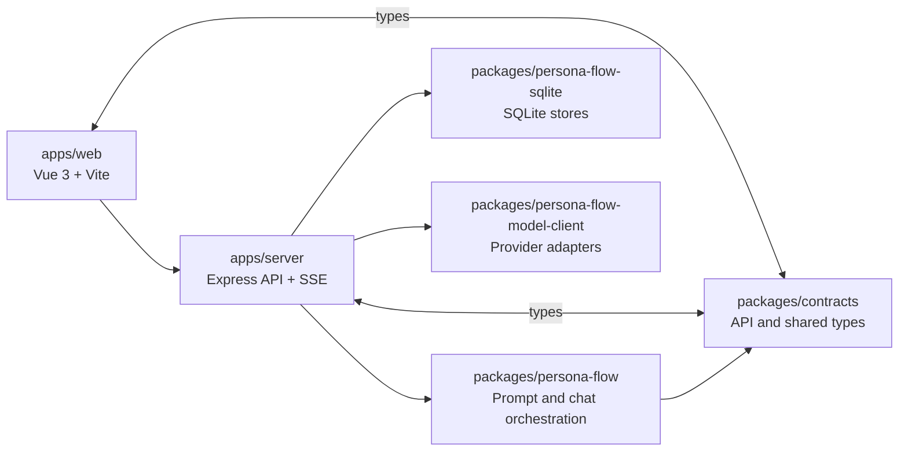

# ss.ai

[English](README.md) | [简体中文](README.zh-CN.md) | 日本語

`ss.ai` は、LLM 駆動のキャラクター会話、TRPG 風インタラクション、structured chat events、そして長期記憶システムを扱う TypeScript / Node.js フルスタックアプリケーションです。単にモデルへメッセージを送るのではなく、prompt context、キャラクター状態、structured model output、永続化、memory consolidation、streaming、debug 経路を保守しやすい形で組み立てることを重視しています。

現時点でもっとも完成している体験は single-character chat です。ユーザーが character と conversation を選び、server が prompt context を組み立て、configured model を structured output で呼び出し、可視 reply、turn events、任意の memory candidates を永続化します。ほかの interaction mode は contracts と UI 形状には存在しますが、runtime model-call dispatch にはまだ接続されていません。

## Live Demo

- GitHub: <https://github.com/cong-jing/ss.ai>
- Live Demo: <http://13.159.36.248:8080/>

## Core Features

- Character / conversation management。
- `single_character_chat` の end-to-end flow。
- Structured turn events: model output を `TurnEvent[]` として parse し、UI が text、expression marker、scene-atmosphere marker、debug payload を描画する。
- SSE streaming preview: `/v1/chat/stream` が structured-output JSON text channel から可視 text と event marker を段階的に preview し、最後に canonical `turnEvents` で整合する。
- `chat.main`、`memory.summarize`、`memory.consolidate`、`memory.embed` ごとの model assignment。
- User credential と runtime default による provider API key configuration。
- Long-term-memory persistence pipeline: model が `memoryWriteCandidates` を提出し、server が candidate 記録、embedding、staging evidence 集約を行い、`memory.consolidate` LLM judge で stable facts を retained memories に昇格する。
- Auditable memory decisions: candidate、staging、retained、consolidation decision の各層から、fact の提案、集約、judge 推奨、create/update/merge/ignore/archive まで追跡できる。
- Memory candidates、staging evidence、retained memories 用の debug API。consolidation decisions は audit layer に保存され、trace / decision view は Memory Lab で追加する予定。
- 実モデル呼び出しや永続化なしで prompt assembly を確認できる dry-run endpoint。

## Core Mechanisms



- `packages/contracts` は shared API contracts、interaction modes、model-call purposes、turn events、memory candidate types を定義します。
- `packages/persona-flow` は prompt-context construction、model-call dispatch、chat-turn orchestration、memory core を担当します。
- `packages/persona-flow-sqlite` は characters、conversations、messages、turn events、user settings、credentials、memory tables の SQLite stores を実装します。
- `packages/persona-flow-model-client` は provider-neutral `ModelClient` を具体 provider へ接続します。現在は主に Mistral です。
- `apps/server` は HTTP API、SSE、runtime config、auth modes、dependency wiring を担当します。
- `apps/web` は 3 ペイン chat UI、settings panel、streaming render path、debug surface を提供します。

## Implemented And Pending

Implemented:

- `single_character_chat` の runtime support。
- Structured-output `TurnEvent[]` generation、persistence、UI rendering。
- SSE streaming previews と final event reconciliation。
- Characters、conversations、preferences、credentials、messages、turn events の SQLite persistence。
- Memory candidate recording、embedding、staging evidence aggregation、LLM consolidation judge、retained memory stores、decision audit、debug APIs。
- `default-user` と `local-password` auth modes。
- Staging / production deploy packaging scripts。

Pending or prototype-level:

- `single_character_chat` 以外の interaction modes は runtime model-call dispatch に未接続。
- Frontend Memory Lab / tuning tool は未実装。次に candidate intake、processor controls、trace view、judge preview を用意する。
- Retained memories はまだ prompt context に read-back されていない。次に重要な長期記憶を chat context に注入し、agent loop を支える query tools を追加する。
- Memory consolidation では retained write と decision audit の transaction boundary と operator-facing diagnostics をさらに強化する必要がある。
- Provider API-key encryption hooks はあるが、at-rest encryption は placeholder。

## Tech Stack

- Frontend: Vue 3, Vite, TypeScript
- Backend: Node.js, Express, TypeScript
- Storage: SQLite, Drizzle ORM, better-sqlite3
- LLM: provider abstraction, structured output, streaming, embeddings
- Tooling: pnpm workspace, tsx, TypeScript project tests, deploy scripts

## Quick Start

```bash
npm run setup
pnpm install
pnpm run dev:server
pnpm run dev:web
pnpm run build
pnpm run test
```

ローカルサーバーのデフォルト URL は `http://127.0.0.1:8999` です。

## Further Reading

- [Project Map](docs/project-map.md)
- [Memory Subsystem Notes](docs/project-map-memory.zh-CN.md)
- [Project Map (简体中文)](docs/project-map.zh-CN.md)
- [Project Map (日本語)](docs/project-map.ja.md)
- [TODO / Roadmap Notes](docs/todo.md)
