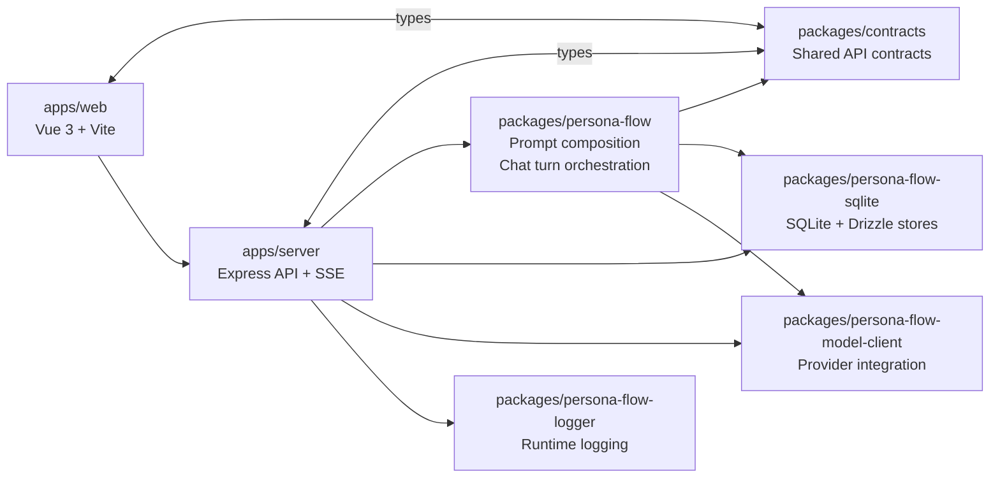

# ss.ai

[English](README.md) | [简体中文](README.zh-CN.md) | 日本語

`ss.ai` は、LLM を用いたキャラクター会話と TRPG 風インタラクションを中心にした、個人開発の TypeScript/Node.js プロジェクトです。このプロジェクトの重点は単なる prompt 実験ではなく、保守しやすいフルスタックアプリケーションをどう設計するか、つまりモジュール境界、永続化、モデル抽象化、デプロイ可能なランタイム構成をどう組み立てるかにあります。

Vue 3 を使ったフロントエンド、Express ベースの API、workspace 全体で共有される contracts、そして prompt の組み立てと chat turn のオーケストレーションを担うドメインパッケージによって構成された、アプリケーション設計と実装のサンプルとして読むのが適しています。

## Live Demo

- GitHub: <https://github.com/cong-jing/ss.ai>
- Live Demo: <http://13.159.36.248:8080/>

デモ環境では、ユーザー名とパスワードだけで登録できます。メール認証は不要で、主要な導線は自前の API キーがなくても試せます。

## Highlights

- pnpm workspace を使った TypeScript/Node.js モノレポ構成と明確な package 境界
- Vue 3 + Vite フロントエンドと Express API サーバーの分離構成
- SSE ベースのチャット応答経路と structured model call の両立
- 会話、キャラクター、ユーザー設定、provider credential を扱う SQLite 永続化
- purpose ごとのモデル割り当てを含む LLM provider abstraction 設計
- 再利用可能なドメインパッケージを中心にした prompt composition と chat turn orchestration
- ログ、設定管理、テスト、デプロイスクリプトまで含めたエンドツーエンドの実装

## Architecture



## Tech Stack

- Frontend: Vue 3, Vite, TypeScript
- Backend: Node.js, Express, TypeScript
- Storage: SQLite, Drizzle ORM, better-sqlite3
- LLM integration: provider abstraction, model assignment, structured output, streaming path
- Tooling and ops: pnpm workspace, tsx, workspace tests, deployment scripts

## What Is Working Now

- キャラクター会話 UI と、会話・コンテキスト向けの各種パネル
- SQLite による会話、キャラクター、ユーザー設定の永続化
- provider credential 入力と purpose ごとのモデル割り当て
- structured chat 呼び出しと SSE レスポンス経路
- 実際のモデル呼び出しなしで prompt 組み立てを確認できる dry-run 経路
- staging / production 向けのデプロイ出力

## Current Limitations

- `single_character_chat` はまだ token 単位の streaming ではなく、SSE 経路でも現状は返信全体を 1 回で返します
- API とランタイムの一部には、実質的に single-user 前提の箇所が残っています
- provider credential 用の暗号化フックはあるものの、保存時暗号化はまだプレースホルダー実装です
- このリポジトリは安定化した汎用 OSS フレームワークではなく、ポートフォリオ兼実装検証プロジェクトです

## Quick Start

```bash
npm run setup
pnpm install
pnpm run dev:server
pnpm run dev:web
pnpm run build
pnpm run test
```

ローカルサーバーのデフォルト URL は `http://127.0.0.1:8999` です。

## Further Reading

- [Project Map](docs/project-map.md)
- [Project Map (简体中文)](docs/project-map.zh-CN.md)
- [Code Review Notes](docs/code-review-2026-05-31.md)
- [TODO / Roadmap Notes](docs/todo.md)