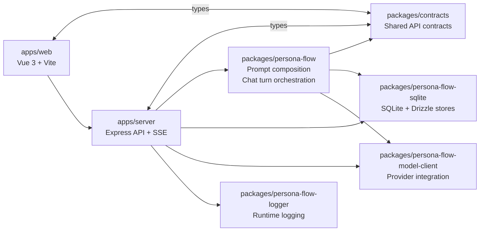

# ss.ai

English | [简体中文](README.zh-CN.md) | [日本語](README.ja.md)

`ss.ai` is a personal TypeScript/Node.js project for LLM-driven character chat and TRPG-style interaction. The focus is not just prompt experimentation, but building a maintainable full-stack application with clear module boundaries, persistent state, model abstraction, and deployable runtime paths.

It is best read as an application architecture and implementation exercise: Vue 3 on the frontend, an Express API on the backend, shared contracts across the workspace, and a domain package that owns prompt composition and chat-turn orchestration.

The architecture is intended to grow toward multiple interaction modes, but at the moment only `single_character_chat` is fully implemented end to end. Other modes are planned in contracts and UI shape, but are not yet wired into runtime prompt/model-call execution.

## Live Demo

- GitHub: <https://github.com/cong-jing/ss.ai>
- Live Demo: <http://13.159.36.248:8080/>

## Highlights

- TypeScript/Node.js monorepo organized with pnpm workspace packages and clear package boundaries
- Vue 3 + Vite frontend separated from an Express-based API server
- Structured-output turn-event chat flow with SSE streaming previews
- SQLite-backed persistence for conversations, characters, user preferences, and provider credentials
- LLM provider abstraction, per-purpose model assignment, and retained tool-call interfaces for future agent/query tools
- Prompt composition and chat-turn orchestration centered in a reusable domain package
- End-to-end project scope including logging, config management, tests, and deployment scripts

## Architecture



## Tech Stack

- Frontend: Vue 3, Vite, TypeScript
- Backend: Node.js, Express, TypeScript
- Storage: SQLite, Drizzle ORM, better-sqlite3
- LLM integration: provider abstraction, model assignment, structured output, streaming path
- Tooling and ops: pnpm workspace, tsx, workspace tests, deployment scripts

## What Is Working Now

- Character chat UI with conversation and context panels
- Conversation, character, and user-preference persistence on SQLite
- Provider credential input and per-purpose model assignment
- Structured-output chat calls and SSE streaming previews
- Turn-event rendering in the web chat UI, including inline expression / scene-atmosphere markers and final canonical reconciliation from `turnEvents`
- End-to-end runtime support for `single_character_chat`; other interaction modes remain planned rather than implemented
- Prompt dry-run path for debugging prompt assembly without sending a live model call
- Deploy packaging for staging and production targets

## Current Limitations

- Only `single_character_chat` is wired into runtime model-call dispatch; other interaction modes remain placeholders
- Several API and runtime assumptions are still effectively single-user oriented
- Provider credential encryption hooks exist, but at-rest encryption is still a placeholder
- This repository is a portfolio and implementation study, not a stabilized general-purpose OSS framework

## Quick Start

```bash
npm run setup
pnpm install
pnpm run dev:server
pnpm run dev:web
pnpm run build
pnpm run test
```

The local server defaults to `http://127.0.0.1:8999`.

## Further Reading

- [Project Map](docs/project-map.md)
- [Project Map (简体中文)](docs/project-map.zh-CN.md)
- [Project Map (日本語)](docs/project-map.ja.md)
- [TODO / Roadmap Notes](docs/todo.md)
