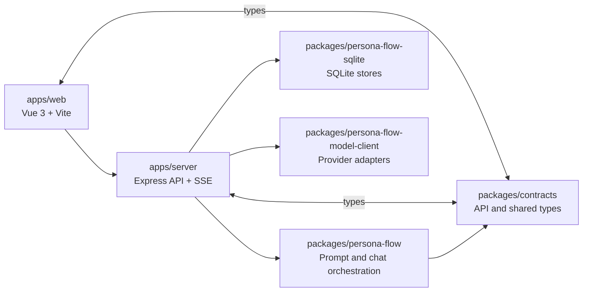

# ss.ai

English | [简体中文](README.zh-CN.md) | [日本語](README.ja.md)

`ss.ai` is a TypeScript / Node.js full-stack application for exploring LLM-driven character chat, TRPG-style interaction, structured chat events, and an early long-term-memory write pipeline. The project is not only about sending messages to a model; it is about organizing prompt context, character state, model output, persistence, streaming, and debugging into a maintainable application.

The most complete experience today is single-character chat. A user selects a character and conversation, sends a message, the server assembles prompt context, calls the configured model with structured output, then persists the visible reply, turn events, and optional memory candidates. Other interaction modes are represented in contracts and UI shape, but are not wired into runtime model-call dispatch yet.

## Live Demo

- GitHub: <https://github.com/cong-jing/ss.ai>
- Live Demo: <http://13.159.36.248:8080/>

## Core Features

- Character and conversation management.
- End-to-end `single_character_chat` flow.
- Structured turn events: model output is parsed as `TurnEvent[]`, and the UI renders text, expression markers, scene-atmosphere markers, and debug payloads from those events.
- SSE streaming preview: `/v1/chat/stream` incrementally previews visible text and event markers from the structured-output JSON text channel, then reconciles against the final canonical `turnEvents`.
- Per-purpose model assignment for `chat.main`, `memory.summarize`, and `memory.embed`.
- Provider API-key configuration with user credentials and runtime defaults.
- Long-term-memory write prototype: the model can submit `memoryWriteCandidates`; the server records candidates, embeds them, ranks active memories by cosine similarity, and writes conservative decisions.
- Read-only debug APIs for memory candidates, active memories, and memory decisions.
- Prompt dry-run endpoint for inspecting prompt assembly without calling a model or persisting a turn.

## Core Mechanisms



- `packages/contracts` defines shared API contracts, interaction modes, model-call purposes, turn events, and memory candidate types.
- `packages/persona-flow` owns prompt-context construction, model-call dispatch, chat-turn orchestration, and the memory core.
- `packages/persona-flow-sqlite` implements `AppStores` on SQLite for characters, conversations, messages, turn events, user settings, credentials, and memory tables.
- `packages/persona-flow-model-client` adapts the provider-neutral `ModelClient` interface to concrete providers, currently Mistral.
- `apps/server` owns HTTP APIs, SSE, runtime configuration, auth modes, and dependency wiring.
- `apps/web` provides the three-panel chat UI, settings panel, streaming render path, and debug surfaces.

## Implemented And Pending

Implemented:

- Runtime support for `single_character_chat`.
- Structured-output `TurnEvent[]` generation, persistence, and UI rendering.
- SSE streaming previews with final event reconciliation.
- SQLite persistence for characters, conversations, preferences, credentials, messages, and turn events.
- Memory candidate recording, embedding, similarity ranking, conservative commit decisions, SQLite memory stores, and read-only debug APIs.
- `default-user` and `local-password` auth modes.
- Staging and production deploy packaging scripts.

Pending or still prototype-level:

- Interaction modes beyond `single_character_chat` are not wired into runtime model-call dispatch.
- Active memories are not read back into prompt context yet, so the memory system currently implements the write side rather than a full RAG loop.
- No LLM judge / merge pipeline yet; near-duplicates route to `needs_judge` and are not automatically merged or deleted.
- `createMemory + candidate status + decision` is not yet one transaction boundary.
- Provider API-key encryption hooks exist, but at-rest encryption is still a placeholder.

## Tech Stack

- Frontend: Vue 3, Vite, TypeScript
- Backend: Node.js, Express, TypeScript
- Storage: SQLite, Drizzle ORM, better-sqlite3
- LLM: provider abstraction, structured output, streaming, embeddings
- Tooling: pnpm workspace, tsx, TypeScript project tests, deploy scripts

## Quick Start

```bash
npm run setup
pnpm install
pnpm run dev:server
pnpm run dev:web
pnpm run build
pnpm run test
```

The local server defaults to `http://127.0.0.1:8999`.

## Further Reading

- [Project Map](docs/project-map.md)
- [Memory Subsystem Notes](docs/project-map-memory.zh-CN.md)
- [Project Map (简体中文)](docs/project-map.zh-CN.md)
- [Project Map (日本語)](docs/project-map.ja.md)
- [TODO / Roadmap Notes](docs/todo.md)
