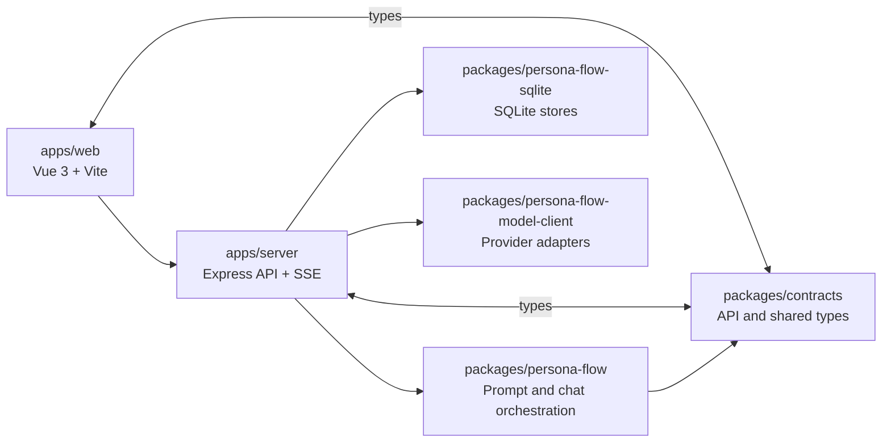

# ss.ai

[English](README.md) | 简体中文 | [日本語](README.ja.md)

`ss.ai` 是一个 TypeScript / Node.js 全栈应用，用来探索 LLM 驱动的角色对话、TRPG 风格交互、结构化聊天事件和长期记忆系统。项目重点不只是把消息发给模型，而是把对话上下文、角色状态、结构化模型输出、持久化、记忆沉淀和调试路径组织成一个可维护的应用。

当前最完整的体验是单角色聊天：用户选择角色和会话后发送消息，服务端组装 prompt，通过配置好的模型获取 structured output，再把可见回复、表情/氛围等事件和候选记忆写入持久化层。其他 interaction mode 已在 contracts 和 UI 结构中预留，但还没有接入运行时模型调用。

## 在线体验

- GitHub: <https://github.com/cong-jing/ss.ai>
- Live Demo: <http://13.159.36.248:8080/>

## 核心功能

- 角色与会话管理：创建角色、切换当前角色、维护每个角色下的会话。
- 单角色聊天：当前已实现 `single_character_chat` 的端到端流程。
- 结构化回合事件：模型输出 `TurnEvent[]`，前端从事件渲染文本、expression、scene atmosphere 等显示片段。
- 流式预览：`/v1/chat/stream` 通过 SSE 逐步推送 structured-output JSON 中的可见文本和事件预览，最终用 canonical `turnEvents` 校正。
- 模型配置：按 model-call purpose 管理模型分配，例如 `chat.main`、`memory.summarize`、`memory.consolidate`、`memory.embed`。
- Provider credential：支持为 provider 保存 API key，并可由 runtime config 提供默认 key。
- 长期记忆保存链路：模型可在 structured output 中提交 `memoryWriteCandidates`；服务端记录候选、生成 embedding、聚合中间 evidence，并通过 `memory.consolidate` LLM judge 把稳定事实沉淀为长期 retained memories。
- 可审计的记忆决策：memory pipeline 保留 candidate、staging、retained 和 consolidation decision 层，便于追踪一条事实从提出、聚合、判断到保存/忽略/合并/归档的完整路径。
- Debug API：提供 memory candidates、staging evidence、retained memories 的查询入口；consolidation decisions 已写入审计层，后续 Memory Lab 会补 trace / decision 查询体验。
- Prompt dry-run：可在不调用模型、不持久化的情况下检查 prompt 组装结果。

## 核心机制



- `packages/contracts` 定义前后端共享的 API、interaction modes、model-call purposes、turn events 和 memory candidate 类型。
- `packages/persona-flow` 负责 prompt context 构建、model-call dispatch、chat turn 编排，以及 memory core。
- `packages/persona-flow-sqlite` 提供 `AppStores` 的 SQLite 实现，保存角色、会话、messages、turn events、用户设置和 memory tables。
- `packages/persona-flow-model-client` 把通用 `ModelClient` 接到具体 provider，目前主要是 Mistral。
- `apps/server` 负责 HTTP API、SSE、runtime config、认证模式和服务端依赖装配。
- `apps/web` 提供三栏聊天界面、设置面板、流式渲染和 debug 展示。

## 已实现与未实现

已实现：

- `single_character_chat` 运行时链路。
- 基于 structured output 的 `TurnEvent[]` 生成、持久化和前端渲染。
- SSE streaming preview 和最终事件校正。
- SQLite 持久化角色、会话、用户偏好、provider credentials、messages 和 turn events。
- memory candidate 记录、embedding、staging evidence 聚合、LLM consolidation judge、retained memory stores、decision audit 和 debug API。
- local-password / default-user 两种认证模式。
- staging / production 部署打包脚本。

尚未实现或仍在原型阶段：

- 除 `single_character_chat` 外的 interaction modes 尚未接入 runtime model-call dispatch。
- 前端 memory debug / tuning 工具仍在设计中，下一步会提供 candidate 追加、processor 手动执行、trace 和 judge preview 等能力。
- Retained memories 还没有回读进 prompt；下一步是把重要长期记忆注入 chat context，并提供 query 工具，支撑后续 agent loop。
- memory consolidation 的写入、audit 和状态迁移还需要继续收紧事务边界与调试体验。
- Provider API key 的加密钩子存在，但当前落库加密仍是占位实现。

## 技术栈

- Frontend: Vue 3, Vite, TypeScript
- Backend: Node.js, Express, TypeScript
- Storage: SQLite, Drizzle ORM, better-sqlite3
- LLM: provider abstraction, structured output, streaming, embeddings
- Tooling: pnpm workspace, tsx, TypeScript project tests, deploy scripts

## 快速开始

```bash
npm run setup
pnpm install
pnpm run dev:server
pnpm run dev:web
pnpm run build
pnpm run test
```

本地服务默认地址是 `http://127.0.0.1:8999`。

## 延伸阅读

- [项目地图](docs/project-map.zh-CN.md)
- [Memory 子系统说明](docs/project-map-memory.zh-CN.md)
- [Project Map (English)](docs/project-map.md)
- [プロジェクトマップ（日本語）](docs/project-map.ja.md)
- [TODO / Roadmap Notes](docs/todo.md)
