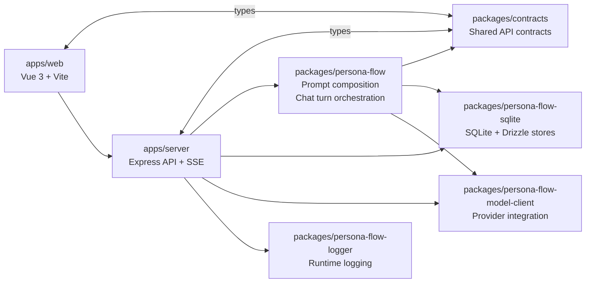

# ss.ai

[English](README.md) | 简体中文 | [日本語](README.ja.md)

`ss.ai` 是一个围绕 LLM 驱动的角色对话与 TRPG 风格交互构建的个人 TypeScript/Node.js 项目。这个项目的重点不只是 prompt 实验，而是验证一个可维护的全栈应用应如何划分模块边界、管理持久化状态、抽象模型接入层，并组织可部署的运行时结构。

你可以把它理解为一次完整的应用架构与实现练习：前端使用 Vue 3，后端使用 Express，工作区内通过共享 contracts 维持前后端一致性，而领域层包负责 prompt 组合与 chat turn 编排。

## 在线体验

- GitHub：<https://github.com/cong-jing/ss.ai>
- Live Demo：<http://13.159.36.248:8080/>

## 项目亮点

- 使用 pnpm workspace 组织的 TypeScript/Node.js monorepo，package 边界明确
- Vue 3 + Vite 前端与 Express API 服务分离
- 同时具备 SSE 聊天响应路径和 structured model call 处理链路
- 使用 SQLite 持久化会话、角色、用户偏好与 provider credentials
- 按用途分配模型的 LLM provider abstraction 设计
- 以可复用领域包为中心的 prompt 组合与 chat turn orchestration
- 覆盖日志、配置管理、测试与部署脚本的端到端工程实现

## 架构



## 技术栈

- 前端：Vue 3、Vite、TypeScript
- 后端：Node.js、Express、TypeScript
- 存储：SQLite、Drizzle ORM、better-sqlite3
- LLM 集成：provider abstraction、model assignment、structured output、streaming path
- 工程与运维：pnpm workspace、tsx、workspace tests、deployment scripts

## 当前已实现内容

- 角色对话 UI，以及围绕会话和上下文的面板组织
- 基于 SQLite 的对话、角色和用户偏好持久化
- Provider credential 输入与按用途保存的模型分配
- Structured chat 调用与 SSE 响应路由接线
- 用于调试 prompt 组装的 dry-run 路径，不必真的发起模型调用
- 面向 staging 和 production 的部署打包输出

## 当前限制

- `single_character_chat` 还没有做到逐 token streaming；当前 SSE 路径仍然是一次性返回完整回复
- 一些 API 与运行时设计仍然默认接近单用户场景
- Provider credential 的加密钩子已经预留，但落盘加密目前仍是占位实现
- 这个仓库更适合作为作品集与实现验证项目，而不是一个稳定的通用 OSS 框架

## 快速开始

```bash
npm run setup
pnpm install
pnpm run dev:server
pnpm run dev:web
pnpm run build
pnpm run test
```

本地服务默认地址是 `http://127.0.0.1:8999`。

## 延伸阅读

- [项目地图（中文）](docs/project-map.zh-CN.md)
- [Project Map (English)](docs/project-map.md)
- [代码审查记录](docs/code-review-2026-05-31.md)
- [TODO / Roadmap Notes](docs/todo.md)