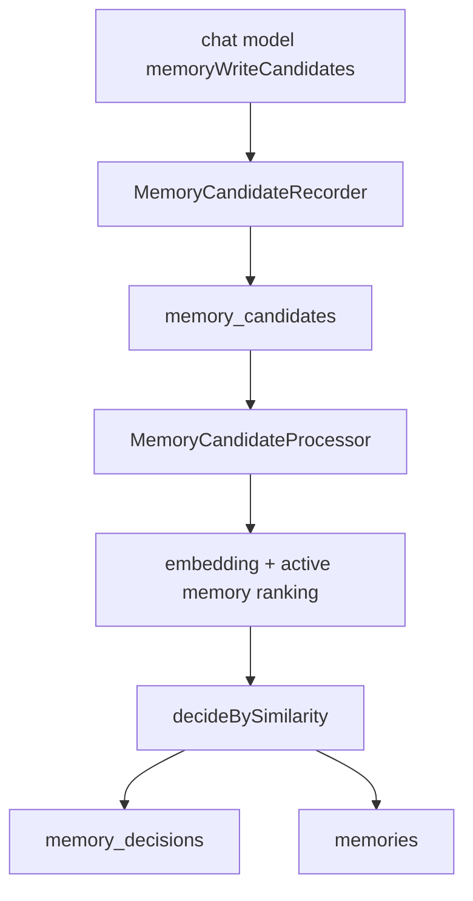
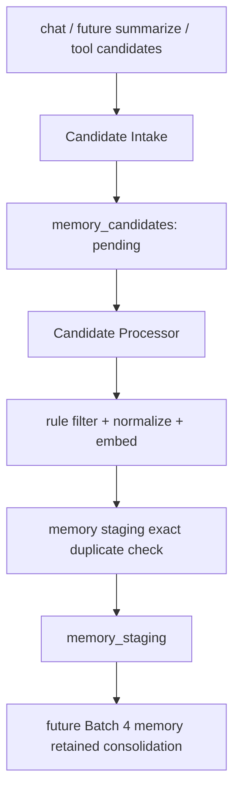
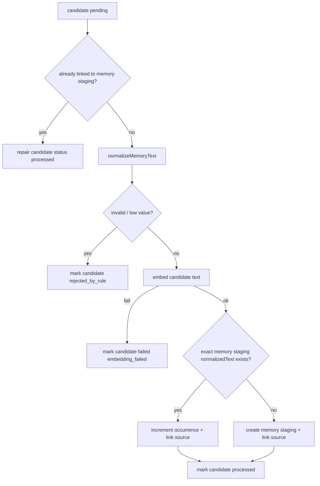

# Memory Batch 3.5 实施计划：Candidate -> Memory Staging 分层重构

[返回分层设计](memory-layered-refactor.zh-CN.md) ｜ [返回 followups](memory-write-followups.md)

本文档是 [Memory 分层重构设计草案](memory-layered-refactor.zh-CN.md) 的 Batch 3.5 详细实施计划。

Batch 3.5 的目标只有一个：把当前 candidate 直接处理并写 active memory 的链路，重构为 candidate intake + candidate processor + memory staging。它不实现 memory staging -> memory retained，不实现 LLM judge，不实现 prompt read injection。

本项目当前没有生产数据兼容要求。memory 相关 SQLite 表可以直接 drop / 重建，不做 migration 兼容层。

## 1. Batch 3.5 目标

### 1.1 做什么

- 简化 candidate intake：外部 model call / future summarize 提交的 candidate 只写入 `memory_candidates`，状态为 `pending`。
- 新增 `memory_staging`：保存经过基础规则校验、normalization、embedding 后的中间记忆。
- 新增 memory staging source 关系：确保 candidate -> memory staging 的处理可追踪、可幂等重跑。
- 改造 `MemoryCandidateProcessor`：默认从 candidate 表读取待处理记录，不再要求调用方传入 records。
- Candidate Processor 只负责 candidate -> memory staging。
- 停止 candidate processor 直接写 memory retained（现有 active memory / retained 层）。
- 用 `status + reason` 保证 fail-soft 后仍可观测。
- 增加采样日志，观察 memory staging 膨胀与 embedding 相似度分布。
- 更新 debug API：可分别查看 candidates 与 memory staging。

### 1.2 不做什么

- 不实现 memory staging -> memory retained。
- 不实现 persona-aware LLM judge。
- 不实现 memory staging LLM，只预留未来方向。
- 不做 memory retained merge / update / archive / forget。
- 不做 prompt injection。
- 不解决跨表事务一致性；只要求幂等重跑。
- 不做定时 worker；只提供可被 inline / 手动 / 未来 worker 调用的 service 方法。

## 2. 当前代码问题

现有写入链路大致是：



问题：

- `memory_candidates` 同时承担 raw input、normalized key、embedding carrier、processing state、debug source。
- `MemoryCandidateProcessor` 同时承担 candidate processing、memory retained write、decision audit。
- `memory_decisions` 的语义是“candidate 对 memory retained 的最终决策”，不适合 candidate -> memory staging 的中间处理。
- Batch 4 如果直接接入 LLM judge，会在旧链路上继续扩大 processor 复杂度。

Batch 3.5 要把链路调整为：



## 3. 数据表设计

### 3.1 `memory_candidates`

Batch 3.5 中，candidate 表回归“原始候选 + 处理状态”。

建议字段：

| 字段 | 说明 |
| --- | --- |
| `id` | candidate id |
| `user_id` | 用户 |
| `character_id` | 角色世界边界 |
| `conversation_id` | 来源会话 |
| `user_message_id` | 来源 user message |
| `assistant_message_id` | 来源 assistant message |
| `request_id` | model request id |
| `model_call_purpose` | 来源 purpose，例如 `chat.main` |
| `source_kind` | 可选，`chat_turn` / `summary` / `manual` / `tool`；Batch 3.5 可先不加，保留 future note |
| `seq` | 同一 assistant turn 内的顺序 |
| `scope` | candidate scope |
| `type` | candidate type |
| `text` | 原始 candidate text，trim 后保存 |
| `related_entities_json` | 原始 relatedEntities |
| `tags_json` | 原始 tags |
| `candidate_reason` | model 给出的 reason；避免和状态 reason 混淆 |
| `status` | `pending` / `processing` / `processed` / `rejected_by_rule` / `failed` |
| `status_reason` | 处理状态原因短 token |
| `schema_version` | schema version |
| `created_at` | 创建时间 |
| `updated_at` | 更新时间 |

建议从 candidate 表移除或停止使用：

- `normalized_text`：移到 memory staging 层生成和保存。
- `embedding_json`：移到 memory staging 层保存。
- 旧 `reason` 字段建议拆成 `candidate_reason` + `status_reason`，避免“模型为什么提交”和“系统为什么这样处理”混在一起。

状态建议：

```ts
export const MEMORY_CANDIDATE_STATUSES = [
  "pending",
  "processing",
  "processed",
  "rejected_by_rule",
  "failed",
] as const;
```

常见 `statusReason`：

- `accepted`
- `schema_invalid`
- `empty_text`
- `empty_after_normalize`
- `punctuation_only`
- `too_short_no_signal`
- `embedding_failed`
- `staging_duplicate_normalized_text`
- `staging_insert_failed`
- `staging_source_link_failed`
- `processed_existing_source_link`

说明：

- `processing` 可选。如果实现时不想处理 claim/lock，可先不使用，只从 `pending` 拉取并在结束时更新状态。
- 事务一致性暂不解决，所以 `statusReason` 要足够解释失败。

### 3.2 `memory_staging`

Memory staging 是 candidate 经过基础处理后的中间层。

建议字段：

| 字段 | 说明 |
| --- | --- |
| `id` | memory staging id |
| `user_id` | 用户 |
| `character_id` | 角色世界边界 |
| `scope` | scope |
| `type` | type |
| `text` | 当前 memory staging 文本；Batch 3.5 直接使用 candidate text |
| `normalized_text` | 用于确定性去重 |
| `related_entities_json` | 聚合后的 related entities |
| `tags_json` | 聚合后的 tags |
| `status` | `pending` / `processed` / `archived` / `forgotten` / `failed` |
| `status_reason` | 状态原因短 token |
| `occurrence_count` | 聚合次数 |
| `first_seen_at` | 第一次来源 candidate 时间 |
| `last_seen_at` | 最近一次来源 candidate 时间 |
| `embedding_json` | `MemoryEmbedding` JSON，含 vector + signature |
| `schema_version` | schema version |
| `created_at` | 创建时间 |
| `updated_at` | 更新时间 |

状态建议：

```ts
export const MEMORY_STAGING_STATUSES = [
  "pending",
  "processed",
  "archived",
  "forgotten",
  "failed",
] as const;
```

Batch 3.5 默认只写：

- `pending`：已进入 memory staging，等待未来 memory retained consolidation。
- `failed`：memory staging record 生成后发生不可恢复错误时使用，正常情况下较少。

`processed` / `archived` / `forgotten` 主要留给 Batch 4。

常见 `statusReason`：

- `ready_for_consolidation`
- `aggregated_normalized_duplicate`
- `embedding_failed`
- `archived_by_rule`

### 3.3 `memory_staging_sources`

强烈建议 Batch 3.5 建 source 关系表，而不是只用 `sourceCandidateIds` JSON。

原因：

- 幂等重跑需要按 `candidate_id` 查是否已经关联 memory staging。
- Debug API 需要从 memory staging 追溯到 candidates。
- 未来 Batch 4 需要 occurrence evidence，关系表比 JSON 更容易查询。

建议字段：

| 字段 | 说明 |
| --- | --- |
| `memory_staging_id` | memory staging id |
| `candidate_id` | source candidate id |
| `user_id` | 冗余用户，便于过滤 |
| `character_id` | 冗余角色，便于过滤 |
| `link_reason` | `created_from_candidate` / `aggregated_normalized_duplicate` / future reasons |
| `created_at` | 创建时间 |

主键建议：

- 使用 composite primary key：`(memory_staging_id, candidate_id)`。
- 不需要独立 `id` 字段。

这里的含义是：source 表本身只是“哪条 candidate 贡献到了哪条 memory staging”的连接关系，不是一个需要单独生命周期的业务对象。独立 id 是给每条连接关系再生成一个 `id`；composite primary key 则直接用这两个外键共同当主键，天然表达“同一个 candidate 不能重复连接到同一个 memory staging”。

建议唯一约束：

- `candidate_id` unique，保证同一 candidate 不会链接到多个 memory staging。
- `(memory_staging_id, candidate_id)` 由 composite primary key 保证唯一。
- store 提供 `findByCandidateId`。

Drizzle schema 需要在表定义层表达 composite primary key 和 `candidate_id` unique；store 层仍应先查再插，保证逻辑幂等和更清晰的错误处理。

### 3.4 `memory_retained`

Batch 3.5 不再写 memory retained。

现有 `memories` 表可以直接 drop。新 retained 层建议使用 `memory_retained` 表名，保持所有 memory 子系统表名前缀一致：

- `memory_candidates`
- `memory_staging`
- `memory_staging_sources`
- `memory_retained`

Batch 3.5 可以先建出 `memory_retained` 的空表和 store 语义，但 candidate processor 不写入它。若实现时为了降低一次性代码 churn 暂时保留 `MemoryStore` port，也应在 SQLite 表名和注释上转向 `memory_retained`，避免继续扩散旧的 active memory 命名。

## 4. `memory_decisions` 表怎么处理

### 4.1 结论

Batch 3.5 不建议继续复用现有 `memory_decisions`。

建议处理：

- 直接 drop / 移除 `memory_decisions` 表和 `MemoryDecisionStore` 在 Batch 3.5 主路径中的依赖。
- Candidate -> memory staging 阶段不写 decision row。
- 可观测性由以下三处承担：
  - `memory_candidates.status + status_reason`
  - `memory_staging.status + status_reason`
  - `memory_staging_sources.link_reason`
- `MemoryDecisionRecorder` / `MemoryDecisionStore` 可以在代码中删除，或暂时保留但不从 `createMemoryPipelineService` 注入 candidate processor。

### 4.2 为什么不复用旧表

现有 `memory_decisions` 的语义是：

- 某个 candidate 最终是否 create active memory。
- 是否 ignore_duplicate / ignore_low_value / needs_judge。
- 保存 candidate 与 active memory 的 topK similarity summary。
- `memoryId` 指向最终创建的 active memory。

Batch 3.5 的 candidate -> memory staging 阶段不是最终决策：

- memory staging 不是 memory retained。
- candidate 进入 memory staging 不代表应该长期保留。
- exact duplicate 只是在 memory staging 层聚合，不是“长期记忆重复”。
- high similarity 暂时不 merge，只记录采样 evidence。

如果继续使用 `memory_decisions`，会让 `decision=create` / `memoryId` / `needs_judge` 等字段产生误导：看起来像已经做了 memory retained decision，实际只是进入 memory staging。

### 4.3 未来 Batch 4 的 decision 表

Batch 4 应重新设计 memory retained consolidation 的 decision 表，而不是被旧 `memory_decisions` 牵着走。

候选方向：

- 新表名：`memory_retained_decisions` 或 `memory_consolidation_decisions`，优先考虑 `memory_retained_decisions` 以保持表名前缀一致。
- 输入对象：一个或多个 `memory_staging_id`。
- 目标对象：可选 `memory_retained_id`。
- decision：`create_retained` / `update_retained` / `merge_retained` / `ignore_staging` / `archive_staging` / `forget_staging` / `needs_review` / `error`。
- 保存 LLM judge 输入摘要、输出、reasoning、confidence、policyVersion。

这部分不在 Batch 3.5 实现，只在文档中保留方向。

## 5. Domain 模块调整

建议目录结构：

```text
packages/persona-flow/src/memory/
  candidate/
    candidateTypes.ts
    candidatePorts.ts
    MemoryCandidateRecorder.ts
    textNormalization.ts
  staging/
    memoryStagingTypes.ts
    memoryStagingPorts.ts
    MemoryStagingProcessor.ts
  embedding/
    ...existing
  logging/
    ...existing
  stores/
    memoryRetainedStorePort.ts # memory retained, Batch 3.5 可先只保留空表 / 查询能力
  MemoryPipelineService.ts
  createMemoryPipelineService.ts
  settings.ts
```

### 5.1 Candidate types

调整 `MemoryCandidateStatus`：

```ts
export const MEMORY_CANDIDATE_STATUSES = [
  "pending",
  "processing",
  "processed",
  "rejected_by_rule",
  "failed",
] as const;
```

调整 `MemoryCandidateRecord`：

- 去掉或停止使用 `normalizedText`。
- 去掉或停止使用 `embedding`。
- `reason` 拆为：
  - `candidateReason?: string`
  - `statusReason?: string`

如果为了少改动临时保留 `normalizedText` / `embedding` 字段，也应标记为 deprecated，不再由 candidate intake 写入。

### 5.2 Candidate store port

建议接口：

```ts
export interface AppendMemoryCandidatesInput {
  source: MemoryCandidateSource;
  candidates: MemoryCandidateDraft[];
}

export interface ListMemoryCandidatesInput {
  userId: string;
  characterId?: string;
  conversationId?: string;
  assistantMessageId?: string;
  status?: MemoryCandidateStatus | MemoryCandidateStatus[];
  limit?: number;
}

export interface UpdateMemoryCandidateStatusInput {
  candidateId: string;
  status: MemoryCandidateStatus;
  statusReason?: string;
  updatedAt: string;
}

export interface MemoryCandidateStore {
  appendCandidates(input: AppendMemoryCandidatesInput): Promise<MemoryCandidateRecord[]>;
  listCandidates(input: ListMemoryCandidatesInput): Promise<MemoryCandidateRecord[]>;
  updateCandidateStatus(input: UpdateMemoryCandidateStatusInput): Promise<void>;
}
```

删除 candidate store 中的 `saveCandidateEmbedding()`。Embedding 属于 memory staging。

### 5.3 Candidate recorder

`MemoryCandidateRecorder` 只做：

- trim text。
- 拒绝结构上为空的 candidate。
- append candidate rows。
- fail-soft 返回 `storeError`。

不再做：

- `normalizeMemoryText()`。
- 生成 `normalizedTexts`。
- embedding。
- processing decision。

### 5.4 Memory Staging types

新增：

```ts
export const MEMORY_STAGING_STATUSES = [
  "pending",
  "processed",
  "archived",
  "forgotten",
  "failed",
] as const;

export type MemoryStagingStatus = typeof MEMORY_STAGING_STATUSES[number];

export interface MemoryStagingRecord {
  id: string;
  userId: string;
  characterId: string;
  scope: MemoryScope;
  type: MemoryCandidateType;
  text: string;
  normalizedText: string;
  relatedEntities: string[];
  tags: string[];
  status: MemoryStagingStatus;
  statusReason?: string;
  occurrenceCount: number;
  firstSeenAt: string;
  lastSeenAt: string;
  embedding?: MemoryEmbedding;
  schemaVersion: number;
  createdAt: string;
  updatedAt: string;
}

export interface MemoryStagingSourceRecord {
  id: string;
  memoryStagingId: string;
  candidateId: string;
  userId: string;
  characterId: string;
  linkReason: string;
  createdAt: string;
}
```

### 5.5 Memory Staging store port

建议接口：

```ts
export interface FindMemoryStagingByCandidateInput {
  candidateId: string;
}

export interface FindExactMemoryStagingInput {
  userId: string;
  characterId: string;
  scope: MemoryScope;
  type: MemoryCandidateType;
  normalizedText: string;
  status?: MemoryStagingStatus | MemoryStagingStatus[];
}

export interface CreateMemoryStagingInput { ... }

export interface LinkMemoryStagingSourceInput {
  memoryStagingId: string;
  candidateId: string;
  userId: string;
  characterId: string;
  linkReason: string;
  createdAt: string;
}

export interface IncrementMemoryStagingOccurrenceInput {
  memoryStagingId: string;
  relatedEntities: string[];
  tags: string[];
  lastSeenAt: string;
  updatedAt: string;
}

export interface ListMemoryStagingInput {
  userId: string;
  characterId?: string;
  scope?: MemoryScope | MemoryScope[];
  type?: MemoryCandidateType | MemoryCandidateType[];
  status?: MemoryStagingStatus | MemoryStagingStatus[];
  limit?: number;
}

export interface MemoryStagingStore {
  findBySourceCandidate(input: FindMemoryStagingByCandidateInput): Promise<MemoryStagingRecord | undefined>;
  findExact(input: FindExactMemoryStagingInput): Promise<MemoryStagingRecord | undefined>;
  create(input: CreateMemoryStagingInput): Promise<MemoryStagingRecord>;
  linkSource(input: LinkMemoryStagingSourceInput): Promise<void>;
  incrementOccurrence(input: IncrementMemoryStagingOccurrenceInput): Promise<MemoryStagingRecord>;
  list(input: ListMemoryStagingInput): Promise<MemoryStagingRecord[]>;
}
```

实现时可以把 `create + linkSource` 分成两个 store 方法，事务一致性后续再统一；幂等靠 `findBySourceCandidate` 补。

## 6. Candidate Processor 设计

### 6.1 输入输出

Batch 3.5 后 processor 不要求外部传入 candidate records。

建议：

```ts
export interface ProcessPendingCandidatesInput {
  userId?: string;
  characterId?: string;
  limit?: number;
}

export interface ProcessPendingCandidatesResult {
  scannedCount: number;
  processedCount: number;
  rejectedCount: number;
  failedCount: number;
  outcomes: CandidateToStagingOutcome[];
}
```

`MemoryPipelineService.handleChatTurnCandidates()` 在 inline 模式下可以调用：

```ts
processPendingCandidates({
  userId: source.userId,
  characterId: source.characterId,
  limit: settings.memory.staging.candidateBatchLimit,
})
```

### 6.2 单条 candidate 处理流程



### 6.3 低价值 / rule filter

可复用现有 `isLowValueCandidate()`，但 reason token 改为 candidate status reason：

- `empty_after_normalize`
- `too_short_no_signal`
- `punctuation_only`

注意：Batch 3.5 的 filter 只拒绝明显无效内容，不判断长期价值。

### 6.4 Embedding

- 仍使用 `MemoryEmbeddingStep` + `ModelClientMemoryEmbeddingProvider`。
- embedding 结果保存到 memory staging。
- candidate 表不再保存 embedding。
- embedding 失败时：candidate 标记为 `failed / embedding_failed`，不创建 memory staging。
- embedding 失败必须输出 warning log，至少包含 `candidateId`、`userId`、`characterId`、`scope`、`type`、错误 reason；不要只静默更新状态。
- Batch 3.5 不允许创建无 embedding 的 memory staging，简化 downstream。

### 6.5 Exact duplicate / occurrence 聚合

Batch 3.5 只自动聚合 normalized text 完全相同的 memory staging。

匹配条件：

- `userId`
- `characterId`
- `scope`
- `type`
- `normalizedText`
- `status in ["pending"]`，是否包含 archived/failed 由实现时决定，默认不包含。

命中时：

- 不插入新 memory staging。
- `occurrenceCount += 1`。
- `lastSeenAt = now()`。
- 合并 relatedEntities / tags（去重）。
- 插入 `memory_staging_sources` link。
- candidate 标记 `processed / staging_duplicate_normalized_text`。

未命中时：

- 创建 memory staging。
- occurrenceCount = 1。
- firstSeenAt = candidate.createdAt。
- lastSeenAt = now()。
- status = `pending`。
- statusReason = `ready_for_consolidation`。
- 插入 source link。
- candidate 标记 `processed / staging_created`。

时间戳语义：`firstSeenAt` 表示这条事实第一次在对话中出现的时间，固定为首条 source candidate 的 `createdAt`。`lastSeenAt` 表示系统最近一次接受到这条证据的处理时间，统一取 `now()`，不区分 inline 与 record_only 批处理重放，避免把 candidate 时间戳一路传到 update 调用。

### 6.6 Embedding high similarity 采样

Batch 3.5 不因 embedding high similarity 自动 merge。

但为了 Batch 4，processor 可以在 create memory staging 前或后做一个轻量扫描：

- 读取同 bucket memory staging records。
- 计算 similarity。
- 记录 top match 到 debug log。
- 不改变 write decision。

日志字段建议：

```ts
{
  event: "memory.staging.similarity_sample",
  candidateId,
  stagingMemoryId,
  scope,
  type,
  topMatch: {
    stagingMemoryId,
    similarity,
    normalizedText,
  },
  sampledCount,
  embeddingSignature,
}
```

如果担心 Batch 3.5 scope 变大，可以只记录 normalized duplicate，不做 high similarity scan。文档建议保留接口和 log 事件名，具体是否执行由实现时控制。

## 7. MemoryPipelineService 调整

### 7.1 当前语义

当前 `handleChatTurnCandidates()` 做：

- recorder 写 candidates。
- inline 时直接 processor 处理这些 accepted candidates。
- processor 可能写 active memory 和 decision。

### 7.2 Batch 3.5 后语义

`handleChatTurnCandidates()` 改为：

1. Candidate Intake 写入 candidate rows。
2. 如果 `candidateProcessingMode === "record_only"`，返回。
3. 如果 `candidateProcessingMode === "inline"`，调用 `processPendingCandidates()`。
4. `processPendingCandidates()` 自己从 candidate store 拉 pending rows。

建议新增 public 方法：

```ts
processPendingCandidates(input?: {
  userId?: string;
  characterId?: string;
  limit?: number;
}): Promise<ProcessPendingCandidatesResult>
```

这样未来 worker / debug endpoint / CLI 可以直接复用同一个处理入口。

## 8. Runtime Config 调整

建议保留：

```ts
memory.enabled
memory.candidateProcessingMode
```

新增 `memory.staging` 与 `memory.retained` 两套配置。Batch 3.5 主要使用 `memory.staging`；`memory.retained` 先定义配置形状，Batch 4 / 5 再接入具体行为。未来这些配置可以迁移到 user preference 或 admin UI。

建议配置形状：

```ts
memory: {
  enabled: boolean;
  candidateProcessingMode: "inline" | "record_only";
  staging: {
    enabled: boolean; // default true
    candidateBatchLimit: number; // default 50
    duplicate: {
      normalizedText: boolean; // default true
    };
    similaritySampling: {
      enabled: boolean; // default true
      listLimit: number; // default 100
      topK: number; // default 5
      minSimilarityToLog: number; // default 0.80
    };
  };
  retained: {
    enabled: boolean; // default false until Batch 4
    consolidationMode: "disabled" | "manual" | "scheduled" | "inline"; // default "disabled"
    batchLimit: number; // default 20
    retrieval: {
      listLimit: number; // default 500
      topK: number; // default 10
      minSimilarity: number; // default 0.80
    };
    judge: {
      enabled: boolean; // default false until Batch 4
      modelCallPurpose: "memory.summarize"; // default for now
      maxStagingItems: number; // default 5
      maxRetainedMatches: number; // default 10
    };
  };
}
```

Batch 3.5 需要写入 server config schema 和 config loader 的部分：

- `memory.staging.enabled`
- `memory.staging.candidateBatchLimit`
- `memory.staging.duplicate.normalizedText`
- `memory.staging.similaritySampling.*`

`memory.retained.*` 可以先进入 `DEFAULT_MEMORY_SETTINGS` 和 config schema，默认 disabled，不被 Batch 3.5 pipeline 调用。这样后续 Batch 4 添加 memory retained consolidation 时不需要重新整理 memory config 的层级。

现有 `ranking.needsJudgeThreshold` / `ranking.exactDuplicateThreshold` 属于旧 memory retained write pipeline，Batch 3.5 后不应由 candidate processor 使用。建议迁移或废弃：

- `memory.staging` 不使用这些阈值。
- memory retained 相似度相关项放到 `memory.retained.retrieval`。
- judge 相关项放到 `memory.retained.judge`。

## 9. SQLite Store 调整

### 9.1 `SQLiteMemoryCandidateStore`

改动：

- `appendCandidates` 不再接收 `normalizedTexts`。
- 不写 `normalized_text` / `embedding_json`。
- `reason` 拆分为 `candidate_reason` / `status_reason`。
- 删除 `saveCandidateEmbedding()`。
- `listCandidates` 支持 status filter。
- `updateCandidateStatus` 写 `status_reason`。

### 9.2 `SQLiteMemoryStagingStore`

新增 store，负责：

- `findBySourceCandidate`
- `findExact`
- `create`
- `linkSource`
- `incrementOccurrence`
- `list`

### 9.3 `SQLiteMemoryDecisionStore`

Batch 3.5 建议从主路径移除。

可以选择：

- 删除文件和 port。
- 或保留文件但不从 `createSqliteStores()` 暴露 / 不从 `AppStores` 使用。

为了减少一次性改动，可以先保留文件但不再被 pipeline wiring 引用。SQLite schema 中可以直接删除 `memory_decisions` 表定义，测试中引用旧 debug decision API 的部分需要同步删除或标记为 Batch 4 重建。

### 9.4 `SQLiteMemoryRetainedStore`

Batch 3.5 不要求实现 memory retained 写入逻辑，但需要把 SQLite 表名和 store 语义调整为 memory retained。

要求：

- 旧 `memories` 表可以直接 drop，不做兼容迁移。
- 新表使用 `memory_retained`。
- TypeScript store / port 优先改名为 `MemoryRetainedStore` / `SQLiteMemoryRetainedStore`。
- Batch 3.5 不再由 candidate processor 写入。

## 10. Contracts / Debug API 调整

### 10.1 contracts

现有 memory debug API 里有：

- candidates
- memories
- decisions

Batch 3.5 建议改为：

- candidates
- memory staging
- memory retained

Decision API：

- 直接移除 `/v1/debug/memory-decisions`。
- contracts 中同步删除旧 decisions debug API。
- Batch 4 用新的 memory retained consolidation decisions API 替代，不在 Batch 3.5 保留 deprecated 空响应。

新增 DTO：

```ts
export interface MemoryStagingInfo {
  id: string;
  userId: string;
  characterId: string;
  scope: MemoryScope;
  type: MemoryCandidateType;
  text: string;
  normalizedText: string;
  relatedEntities: string[];
  tags: string[];
  status: MemoryStagingStatus;
  statusReason: string | null;
  occurrenceCount: number;
  firstSeenAt: string;
  lastSeenAt: string;
  embedding: MemoryEmbeddingSignature | null;
  schemaVersion: number;
  createdAt: string;
  updatedAt: string;
}
```

Candidate DTO 调整：

- `reason` -> `candidateReason` + `statusReason`。
- 去掉 candidate embedding 或保留为 null/deprecated。

### 10.2 Server debug route

新增：

- `GET /v1/debug/memory-staging`

支持 filter：

- `characterId`
- `scope`
- `type`
- `status`
- `sourceCandidateId`
- `limit`

Candidates route 增强：

- 支持 `status`。
- 支持 `statusReason` 可选。

Memory retained route 保留，语义上是 memory retained。建议路径使用 `GET /v1/debug/memory-retained`；如短期保留旧 `/v1/debug/memories`，需要标记为兼容别名。

Decisions route：Batch 3.5 直接移除。

## 11. Tests

### 11.1 Domain tests

新增 / 改造：

- `MemoryCandidateRecorder`：只写 raw candidate，不 normalize，不 embedding。
- `MemoryStagingProcessor` 或改造后的 `MemoryCandidateProcessor`：
  - pending candidate -> new memory staging。
  - empty / punctuation-only -> candidate `rejected_by_rule`。
  - embedding failed -> candidate `failed / embedding_failed`。
  - normalized duplicate -> occurrenceCount + source link + candidate processed。
  - same candidate rerun -> 不重复插入 memory staging，修复 candidate status。
  - write memory staging succeeds but candidate status update fails -> rerun repairs status。

### 11.2 SQLite store tests

- `SQLiteMemoryCandidateStore` 新 schema roundtrip。
- `SQLiteMemoryStagingStore.create/list/findExact/findBySourceCandidate/linkSource/incrementOccurrence`。
- source candidate unique / idempotency 行为。

### 11.3 Service / chat integration tests

- `record_only`：chat 后只写 pending candidate，不写 memory staging。
- `inline`：chat 后写 candidate，并处理 pending 到 memory staging。
- memory subsystem failure fail-soft：chat response 成功，candidate / memory staging status 或日志体现失败。
- 不再创建 memory retained。

### 11.4 Debug API tests

- list candidates by status / statusReason。
- list memory staging by character / status / sourceCandidateId。
- memory retained route 仍可用。
- decisions route 按最终选择更新：移除则删除旧测试；deprecated 则测返回说明。

## 12. 推荐实施顺序

1. 更新 contracts：candidate status、memory staging DTO/API、移除或 deprecated decisions API。
2. 更新 domain types：candidate types、memory staging types、ports。
3. 更新 runtime config：`memory.staging` / `memory.retained` schema、loader、defaults。
4. 更新 SQLite schema：重建 candidate 表、`memory_staging` 表、`memory_staging_sources` 表、`memory_retained` 表；移除 decision 表定义。
5. 实现 `SQLiteMemoryStagingStore`。
6. 简化 `MemoryCandidateRecorder` 和 `MemoryCandidateStore`。
7. 改造 processor 为 candidate -> memory staging。
8. 改造 `MemoryPipelineService` 与 factory wiring，移除 decision recorder / memory retained write 依赖。
9. 更新 server debug route。
10. 更新测试。
11. 跑 `pnpm --filter @ss-ai/persona-flow test`、`pnpm --filter @ss-ai/persona-flow-sqlite test`、`pnpm --filter @ss-ai/server test` 或对应可用测试命令。

## 13. 已确认决策

本轮确认：

- `memory_staging_sources` 使用 composite primary key：`(memory_staging_id, candidate_id)`，不使用独立 `id`。
- `processing` candidate status 在 Batch 3.5 先不实现 claim/lock 语义；status 枚举可以先保留，但 processor 不需要写入 `processing`。
- embedding 失败时不创建无 embedding memory staging；candidate 标记 `failed / embedding_failed`，并输出 warning log。
- decisions debug API 直接移除，不保留 deprecated 空响应。
- 旧 `memories` 表直接 drop，新表和 store 改为 `memory_retained` / `MemoryRetainedStore`，不考虑旧数据兼容。
- 跨表事务一致性（create staging + linkSource + update candidate status）本批次不解决，作为后续 todo；本批次依赖 `findBySourceCandidate` 幂等重跑兜底，可能出现极少量 occurrence 重复计数，接受这一代价。
- `processPendingCandidates()` 必须接受 `userId + characterId` 作为处理对象边界，inline 模式下由 `handleChatTurnCandidates()` 传入本次 chat turn 的 user 与 character；不做跨用户或跨角色的全量扫描。
- inline 链路 + similarity sampling 是 Batch 3.5 的临时测试形态，预期延迟与成本不作为本批次优化目标；生产部署会改用向量数据库并迁移到非 inline 处理模式，相关取舍留到那一阶段再处理。
- `lastSeenAt` 在命中聚合与新建 staging 时统一取 `now()`，`firstSeenAt` 在新建 staging 时取首条 source `candidate.createdAt`。详见 6.5 节时间戳语义说明。
