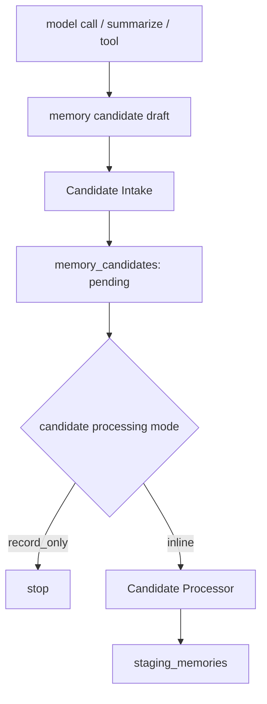
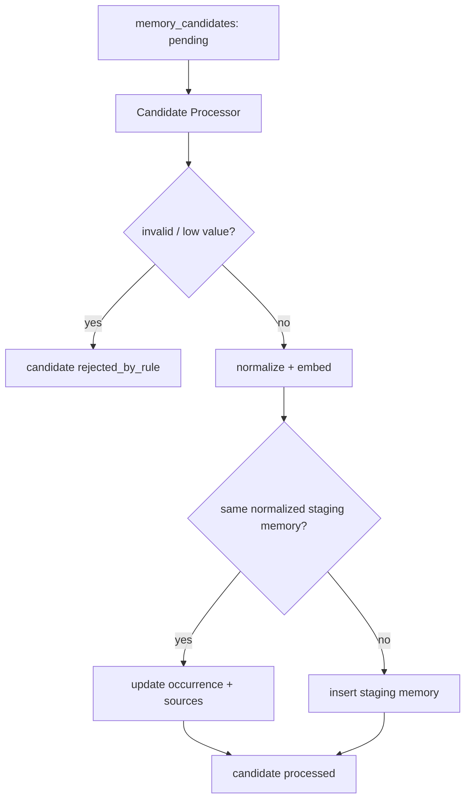
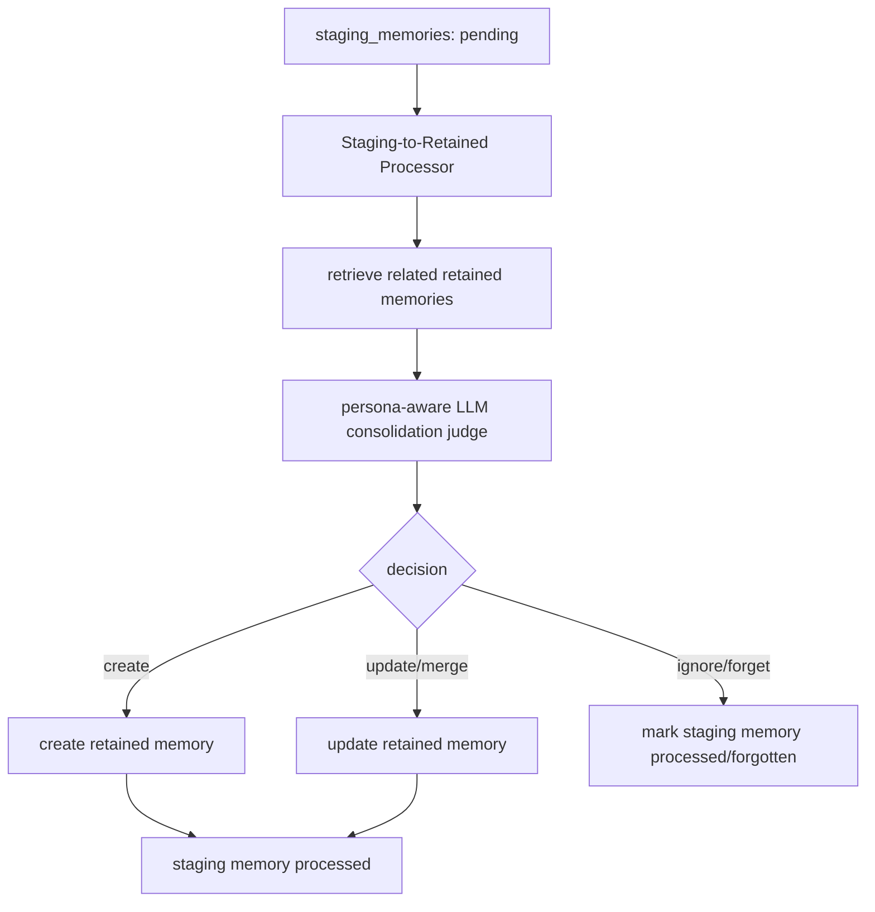

# Memory 分层重构设计草案

[返回 followups](memory-write-followups.md) ｜ [项目地图（Memory 子系统）](../project-map-memory.zh-CN.md)

本文档记录 Batch 4 前的新重构方向：把现有“candidate 直接处理并尝试写 active memory”的链路，调整为更清晰的三层 memory pipeline：

1. `memory_candidates`：原始候选层，只负责接收与审计。
2. `staging_memories`：中间暂存与语义整理层，负责基础清洗、normalization、embedding、轻量去重、近期/未沉淀信息的暂存。
3. `retained_memories`：长期保留层，负责稳定、压缩、角色感知、可注入 prompt 的长期事实。

这份文档先明确设计思路、模块职责和迁移批次边界。Batch 3.5 只做 candidate 到 staging memory 的分层重构；Batch 4 的 LLM judge 与 staging 到 retained 的 consolidation 细节，等 Batch 3.5 完成并观察数据后再单独展开。

## 1. 背景

当前 Batch 2/3 的 memory 写入链路已经具备：

- chat model 在 structured output 中提交 `memoryWriteCandidates`。
- `MemoryCandidateRecorder` 把 candidate 写入 SQLite。
- `MemoryCandidateProcessor` 在 inline 模式下继续做低价值过滤、normalized text 去重、embedding、active memory 扫描、similarity ranking、系统决策，并在低风险时直接写入 active memory。
- ambiguous / similar 的候选进入 `needs_judge`。

这条链路验证了 memory 写入的基本可行性，但也把太多职责压在 candidate processor 上：采集、加工、embedding、相似度扫描、决策、长期记忆写入、decision 审计都在同一条路径里。继续把 LLM judge 直接接在这条路径上，会让 candidate 层过早承担 retained memory 的整理职责。

新的方向是先把 pipeline 拆层：candidate 只表示“外部来源提出了一个候选”；staging memory 表示“系统已经完成基础处理、具备后续检索、聚合、整理和沉淀价值的中间记忆”；retained memory 表示“已经被压缩、合并、角色感知地判定适合长期保留和使用的稳定记忆”。

## 2. 设计原则

- **采集与沉淀分离**：model call、定期 summarize、未来工具调用都可以只写 candidate，不必立刻决定长期保留。
- **处理频率分离**：candidate 到 staging memory 可以较频繁；staging 到 retained memory 可以低频、批处理、成本更高。
- **模型调用后移**：LLM judge 不直接面对每条原始 candidate，而是在 staging memory 已经基础处理和聚合后参与 retained memory consolidation。
- **保留原始审计**：candidate 层尽量少加工，保留“模型原本提交了什么”。
- **staging 层允许冗余，retained 层追求压缩**：staging memory 可以保留相似但不完全一致的信息；retained memory 需要 merge、update、archive、forget、importance 等策略。
- **处理器可主动拉取数据**：processor 不要求调用方传入具体 records；默认从对应表中拉取待处理数据，便于 inline、手动触发、定期任务共用。
- **状态必须可观测**：fail-soft 不等于静默失败。Batch 3.5 暂不做 worker 和 `memory_debug_events` 表，但 candidate / staging 两层必须有足够细的 `status + reason`，能解释 pending 堆积、embedding 失败、重复处理、规则拒绝等情况。
- **处理器必须可安全重跑**：事务一致性暂不在 Batch 3.5 解决，但 candidate -> staging 的处理需要通过 source 关系和 deterministic 去重做到幂等，允许失败后再次扫描 pending / failed records，而不是依赖一次性内存状态。
- **chat fail-soft**：memory 任意阶段失败都不能破坏 chat turn 的成功返回。

本项目当前尚未实际投入生产使用。Batch 3.5 可以直接调整或重建 memory 相关 SQLite 表，不要求兼容旧表数据，也不引入 migration 兼容层。

## 3. 分层模型

### 3.1 Memory Candidate：原始候选层

Candidate 是外部来源提交的“可能值得记住的片段”。它的职责很窄：接收、落库、标记处理状态。

来源可以包括：

- chat model 的 `memoryWriteCandidates`。
- 定期 summarize model call 同步产生的候选。
- 未来的手动录入、导入、工具调用。

Candidate 层应该保存：

- 原始 `text`。
- `scope`、`type`、`relatedEntities`、`tags`、`reason`。
- 来源信息：user、character、conversation、message、request、source purpose。
- candidate 状态：`pending` / `processed` / `rejected_by_rule` / `failed` 等。
- `reason`：状态解释，例如 `schema_invalid`、`empty_after_normalize`、`punctuation_only`、`embedding_failed`、`staging_write_failed` 等。
- 创建与更新时间。

Candidate 层不应该负责：

- embedding。
- normalized text 去重。
- similarity ranking。
- staging / retained memory 写入。
- LLM judge。

这意味着现有 `MemoryCandidateRecorder` 可以进一步简化，甚至不必保留复杂的 candidate 文件夹结构；它只是把外部输入写入 candidate 表。

### 3.2 Staging Memory：中间暂存与语义整理层

Staging memory 是 candidate 经过基础处理后的中间记忆层。它不是最终长期记忆，也不代表系统已经决定长期保留该信息，而是表示该候选已经通过基础校验，具备后续检索、聚合、整理和沉淀价值。

相对于 candidate 层，staging memory 会保存更适合系统内部处理的结构化信息；相对于 retained memory 层，staging memory 仍然允许一定冗余、临时性和不稳定性。

Staging memory 的职责：

- 对 candidate text 做基础清洗与 normalization。
- 生成 `normalizedText`，用于确定性去重。
- 生成 embedding，并保存 embedding signature。
- 过滤明显无效的候选，例如空文本、纯标点、schema 无效、极短且无信息量的文本。
- 处理 normalized text 完全相同的重复候选。
- 保存来源 candidate ids、occurrence count、firstSeenAt、lastSeenAt 等追踪信息。
- 暂存近期信息、未确认信息、未沉淀信息，以及未来可能被整理进 retained memory 的信息。
- 作为后续 retained memory consolidation 的输入。

Staging memory 阶段不负责：

- 判断某条信息是否值得长期保留。
- 根据角色 persona 判断某条信息的重要性。
- 决定某条信息是否应该直接注入 prompt。
- 处理角色关系中的长期回忆、共同经历、冲突、约定等高层语义。
- 对已有 retained memory 执行 merge、update、archive 或 forget。

Candidate 到 staging memory 的处理应保持保守。该阶段只拒绝明显无效或无法处理的候选，而不尝试判断候选的长期价值。只要 candidate 不是明显无效信息，原则上都可以进入 staging memory，留给后续 consolidation 阶段进一步判断。

基础处理规则可以包括：

- empty / punctuation-only candidate：标记 candidate 为 `rejected_by_rule`，不写入 staging memory。
- schema 无效或 scope/type 不合法：标记 candidate 为 `rejected_by_rule` 或 `failed`。
- normalized text 完全相同：不插入新的 staging memory，而是关联到已有 staging memory，并更新 occurrence count、lastSeenAt 和 source 关系。
- embedding 生成成功：保存 embedding 与 embedding signature。
- embedding 生成失败：根据当前策略标记 `failed`，或允许无 embedding 的 staging memory 暂存。
- embedding 高相似：暂时不自动 merge，只作为后续 semantic consolidation 的候选依据。

未来可以在 staging memory 阶段加入可选的低成本 LLM 处理，但 Batch 3.5 暂不实现，只预留接口。

Staging 阶段未来可能使用的 LLM 与 retained 阶段的 LLM 职责不同。Staging LLM 不带角色 persona，不根据角色关系判断记忆价值，只做中性的语义整理，例如：

- 拆分复合 candidate。
- 判断两个候选是否语义接近。
- 判断 candidate 是否可以关联到已有 staging memory。
- 对 candidate 做中性改写。
- 修正 type、tags、relatedEntities 等结构化字段。
- 过滤明显不构成记忆的噪声。

例如，candidate 为“用户喜欢玩游戏，特别是动作游戏和策略游戏”时，未来的 staging LLM 可以将其拆分为更细的 staging memory，例如“用户喜欢玩游戏”“用户特别喜欢动作游戏”“用户特别喜欢策略游戏”，并保留它们来自同一个 candidate 的来源关系。

Retained 阶段的 LLM 则是 persona-aware consolidation。它会结合角色设定、关系状态、已有 retained memory 和 staging memory 证据，判断哪些信息应长期保留、如何合并或更新、哪些适合直接注入 prompt，哪些只应在相关场景下检索。

因此，staging memory 是中性的语义暂存层；retained memory 是角色感知的长期沉淀层。

Staging memory 建议保存：

- `text`：用于中间检索和后续 consolidation 的当前文本。
- `normalizedText`：用于确定性去重。
- `embedding`：用于向量检索。
- `scope` / `type` / `relatedEntities` / `tags`。
- `sourceCandidateIds` 或独立 source 表。
- `occurrenceCount`。
- `firstSeenAt` / `lastSeenAt`。
- `status`：`pending` / `processed` / `archived` / `forgotten` / `failed` 等。
- `reason`：状态解释，例如 `ready_for_consolidation`、`source_candidate_failed`、`embedding_failed`、`archived_by_rule` 等。
- 可选 `importanceHint` 或 `score`，用于后续排序；Batch 3.5 可以先不实现。

### 3.3 Retained Memory：长期保留层

Retained memory 是稳定记忆层，代表系统愿意长期保留、可能注入 prompt 的事实、状态、关系、约定或共同经历。

Retained memory 的职责：

- 存储压缩后的长期事实。
- 支持 importance、flags、scope、type、实体关系等筛选。
- 支持 prompt injection。
- 支持被 retained-stage LLM judge 更新、合并、删除、归档或遗忘。
- 保留必要的来源与决策审计。

当前代码中的 `memories` / active memory 表可以暂时继续承担 retained memory 角色，不必在 Batch 3.5 改名。后续如果需要更清晰命名，再迁移为 `retained_memories`。

## 4. 模块职责

### 4.1 Candidate Intake

职责：

- 接收来自 model call / summarize / 外部工具的 candidate draft。
- 生成 id、seq、source metadata。
- 写入 `memory_candidates` 表，状态为 `pending`。
- 不做 embedding，不做 similarity，不写 staging / retained memory。

可能对应现有代码：

- 保留或简化 `MemoryCandidateRecorder`。
- `MemoryPipelineService.handleChatTurnCandidates()` 只负责调用 intake，然后按配置决定是否触发后续 processor。

### 4.2 Candidate Processor：candidate -> staging memory

职责：

- 默认从 `memory_candidates` 表拉取 `pending` records。
- 对每条 candidate 做基础规则过滤。
- 生成 `normalizedText`。
- 调 embedding provider 生成向量。
- 查询 staging memory 表做 normalized text 去重/聚合。
- 写入或更新 `staging_memories`。
- 把 candidate 标记为 `processed` / `rejected_by_rule` / `failed`。

不负责：

- 查询 retained memory。
- 直接写 retained memory。
- 调用 persona-aware LLM judge。
- 做复杂 merge / archive / forget。

### 4.3 Staging Memory Store

职责：

- 保存 staging memory records。
- 支持按 `userId + characterId + scope + type + status` 拉取。
- 支持 exact normalized text 查重。
- 支持保存 embedding。
- 支持 occurrence count / lastSeenAt 更新。
- 支持通过 source candidate id 查找已关联 staging memory，保证 processor 重跑时不会重复插入。
- 支持列出待 consolidation 的 staging memories。

### 4.4 Staging-to-Retained Processor：staging memory -> retained memory

职责：

- 默认从 `staging_memories` 拉取 `pending` / 未处理 records。
- 查询 retained memory 中相似或相关 records。
- 在 Batch 4 中调用 persona-aware LLM judge / consolidation model。
- 根据 judge 结果对 retained memory 执行 create / update / merge / archive / ignore / forget。
- 将 staging memory 标记为 processed / archived / forgotten / failed。
- 记录 consolidation decision。

注意：这个模块是 Batch 4 的主角，Batch 3.5 不实现。

### 4.5 Retrieval / Prompt Injection

长期方向：

- chat prompt 默认注入 retained memory，尤其是重要记忆、特殊 flag、强相关记忆。
- query 时可以先查 staging memory 中 `pending` 且未 archived 的近期信息，再查 retained memory。
- staging memory 不是默认大量注入 prompt 的对象，避免近期噪声污染角色输出。

Batch 3.5 不做 read injection；Batch 5 再处理 prompt 注入闭环。

## 5. 新数据流

### 5.1 Chat 或 summarize 后

### 5.2 定期 candidate -> staging memory

### 5.3 Batch 4 后的 staging -> retained

## 6. Batch 3.5：分层重构范围

Batch 3.5 目标：把 candidate 层和 memory processor 层拆开，引入 staging memory 表，并停止“candidate processor 直接写 retained memory”的行为。

### 6.1 做什么

- 简化 candidate intake：candidate 只落库为 pending。
- 调整 candidate 表：如有必要，去掉 candidate embedding 的核心职责；可以暂时保留旧列但不再作为主要处理载体。
- 新增 staging memory domain types / store port / SQLite store。
- 新增或重写 Candidate Processor：
  - 默认从 candidate 表读取 pending records。
  - 基础规则过滤。
  - 生成 normalizedText。
  - embedding。
  - exact duplicate 检查只针对 staging memory。
  - embedding 高相似暂时不自动 merge，只记录或留给后续 consolidation。
  - 插入或更新 staging memory。
  - 更新 candidate 状态和 reason。
  - 处理过程必须幂等：如果同一个 candidate 已经关联到 staging memory，重跑时应识别并更新状态，而不是重复插入。
- 调整 `MemoryPipelineService`：
  - chat 后只 intake candidate。
  - 当 `candidateProcessingMode === "inline"` 时触发 Candidate Processor。
  - processor 不要求调用方传 records。
- 更新 debug API：能分别查看 candidates 与 staging memories，并能按 `status` / `reason` 查看 pending、failed、rejected、processed 的记录。
- 更新采样日志：记录 candidate -> staging 阶段的 normalized duplicate、embedding high-similarity top match、插入 / 聚合结果，便于 Batch 4 评估 staging 膨胀与相似度阈值。
- 更新测试：覆盖 candidate intake、pending pull、candidate -> staging memory、record_only / inline、失败 reason、幂等重跑几种模式。

### 6.2 不做什么

- 不实现 staging memory 到 retained memory 的处理。
- 不调用 persona-aware LLM judge。
- 不实现 staging LLM；只预留未来可选接口。
- 不做 retained memory update / merge / archive / forget。
- 不做 prompt injection。
- 不把 summarize 接入 candidate 生产；只保证未来可以接。
- 不要求完整的调度器或 worker；只保留 service 方法，便于未来定时调用。
- 不解决跨 store / 跨表事务一致性；Batch 3.5 只要求幂等重跑和状态可观测，真正的事务边界留到后续处理。
- 不保证产生 retained memory。Batch 3.5 之后到 Batch 4 完成之前，会存在“只产出 staging memory、不再新增 retained memory”的空窗期；当前产品阶段可以接受这个空窗，因为 memory read injection 尚未形成闭环。

### 6.3 与当前 Batch 2/3 代码的迁移点

现有代码迁移方向：

- `MemoryCandidateRecorder`
  - 保留为 Candidate Intake，移除或弱化 normalization / embedding / decision 相关职责。
- `MemoryCandidateProcessor`
  - 改造为 candidate -> staging memory processor。
  - 不再依赖 active `MemoryStore` 和 `MemoryDecisionStore`。
  - 依赖 `MemoryCandidateStore`、`StagingMemoryStore`、`MemoryEmbeddingStep`、logger、clock。
- `MemoryDecisionRecorder` / `memory_decisions`
  - Batch 3.5 可以直接 drop / 重建旧 decision 相关表；当前没有生产兼容要求。
  - candidate -> staging memory 不再写最终 decision row。
  - 如需要审计 candidate processing，可新增轻量 processing log 或先依赖 status/reason。
- `MemoryStore` / `memories`
  - 暂时保留为 retained memory store，或者直接重建为 retained 语义更清晰的表；当前没有旧数据兼容要求。
  - Batch 3.5 不再由 candidate processor 写入。
- `MemoryPipelineService`
  - public method 可以保留 `handleChatTurnCandidates`，但内部语义变为 intake + optional candidate processing。
  - 新增 `processPendingCandidates()`，供 inline、手动任务、未来 worker 复用。
- `settings.ts`
  - 现有 `candidateProcessingMode` 保留。
  - ranking thresholds 重新归属：candidate -> staging memory 只需要基础去重阈值或暂不使用语义阈值；retained ranking thresholds 留到 Batch 4。

### 6.4 状态可观测性要求

Batch 3.5 不引入后台 worker 和 `memory_debug_events` 表，但最少要做到：

- candidate 与 staging memory 都有 `status`、`reason`、`createdAt`、`updatedAt`。
- candidate processor 每次处理失败都要把失败原因落到 candidate 或 staging memory，而不是只写日志。
- debug API 可以按 status / reason / character / conversation / source candidate 过滤。
- 常见 reason 应使用短 token，方便后续统计，例如 `schema_invalid`、`empty_after_normalize`、`embedding_failed`、`staging_duplicate_normalized_text`、`staging_insert_failed`。

### 6.5 幂等与重复处理策略

事务一致性留到后续批次。Batch 3.5 的最低要求是 processor 可安全重跑：

- staging memory 与 candidate 之间需要可查询的 source 关系。可以先用 `sourceCandidateIds` JSON，也可以直接建 `staging_memory_sources` 关系表；实现时优先选择最容易保证查询和去重的方案。
- 对同一 candidate 重跑时，如果已经有关联 staging memory，应更新 candidate 状态为 processed，而不是插入第二条 staging memory。
- 对 normalized text 完全相同的 candidate，应聚合到已有 staging memory，并更新 occurrence count / lastSeenAt / source 关系。
- 如果“写入 staging 成功但更新 candidate 状态失败”，下次重跑应通过 source 关系识别已处理结果并修复 candidate 状态。
- 如果 embedding 失败，candidate 可以保持 failed 并带 reason；是否允许无 embedding staging memory 暂存，留给实现时按最小方案决定。

### 6.6 Retained 写入空窗期

Batch 3.5 停止从 candidate processor 直接写 retained memory，因此在 Batch 4 完成前，系统会只积累 staging memory，不再新增 retained memory。

这是有意接受的过渡状态：当前 memory 尚未形成 read injection 闭环，产品上可以接受短期内不产出新的可注入长期记忆。这样换来的是更清晰的 pipeline 边界，避免在旧链路上继续叠加 LLM judge 和 merge 复杂度。

### 6.7 Staging 膨胀与采样日志

由于 Batch 3.5 不对 embedding 高相似内容自动 merge，staging memory 可能快速膨胀。Batch 3.5 应先保证可观测：

- 对每次 candidate -> staging 处理，记录是否命中 normalized duplicate。
- 对 embedding 高相似但未合并的情况，记录 top match 的 similarity、scope、type、stagingMemoryId。
- 采样日志不需要保存完整向量，但需要能帮助 Batch 4 判断 similarity baseline 和 consolidation 输入规模。
- 短中文事实 baseline similarity 偏高的问题不在 Batch 3.5 调参解决，只通过日志留证据。

## 7. Batch 4：Staging 到 Retained 的 LLM consolidation（先占位）

Batch 4 不再把 LLM judge 接在 candidate similarity decision 后面，而是接在 staging memory 到 retained memory 的 consolidation 阶段。

### 7.1 Batch 4 方向

- 从 `staging_memories` 中读取未处理、未 archived 的 records。
- 对每条 staging memory 或一组相关 staging memories，查询 retained memories 中相关 records。
- 调用 persona-aware LLM judge / consolidation model。
- 由系统层应用 judge 建议：create / update / merge / ignore / archive / forget / importance bump。
- 标记 staging memory 已处理，避免重复检索。
- 记录 consolidation decision，支持 debug UI 复现。

### 7.2 Batch 4 暂不展开

本阶段不写详细实现文档。需要等 Batch 3.5 完成后，根据 staging memory 的实际数据形态再设计：

- judge prompt 输入格式。
- judge structured output schema。
- staging memory 分组策略。
- retained memory update/merge 语义。
- occurrence count 如何影响 importance 或保留优先级。
- processed / archived / forgotten 的精确状态机。

旧文档 [memory-write-batch4-llm-judge.zh-CN.md](memory-write-batch4-llm-judge.zh-CN.md) 描述的是“candidate 后立即 judge”的方案。该方案被本文档的新路线取代，仅作为历史参考。

## 8. Batch 5：Memory Read Injection

Batch 5 仍然是读取闭环，但读取对象需要区分：

- Retained memory：主要 prompt 注入来源。
- Staging memory：query-time / recent unresolved context，可按需注入，不应默认大量注入。

Batch 5 需要在 Batch 3.5 / 4 的数据模型稳定后再展开。

## 9. 推荐迁移顺序

1. 更新 docs 与 roadmap，明确旧 batch4 方案废弃。
2. 在 domain 层定义 `StagingMemoryRecord`、`StagingMemoryStore` port、candidate processing input/output，以及 status / reason token。
3. 在 SQLite 层重建 memory 相关表，新增 `staging_memories` 表与 store；旧表无需兼容。
4. 改造 Candidate Processor：从 candidate 表拉 pending，写 staging memory，不再写 retained memory。
5. 补齐幂等重跑：source candidate 关系、normalized duplicate 聚合、写 staging 后状态修复。
6. 改造 `MemoryPipelineService`：intake 与 process pending 分离。
7. 更新 chat turn 集成：chat 后只写 candidate；inline 模式触发 pending candidate processor。
8. 更新 debug API、采样日志与测试。
9. 跑一次现有 memory/chat 测试，确认 chat fail-soft 行为不变。

## 10. 命名备注

本文档使用：

- `memory_candidates`：原始候选。
- `staging_memories`：中间暂存与语义整理层。
- `memories` / `retained_memories`：长期保留层。

代码迁移时可以先保留现有 `memories` 表名，语义上把它视为 retained memory；也可以直接 drop 后重建为 retained 语义更清晰的表。当前没有生产数据兼容要求，优先选择实现简单、边界清楚的方案。
