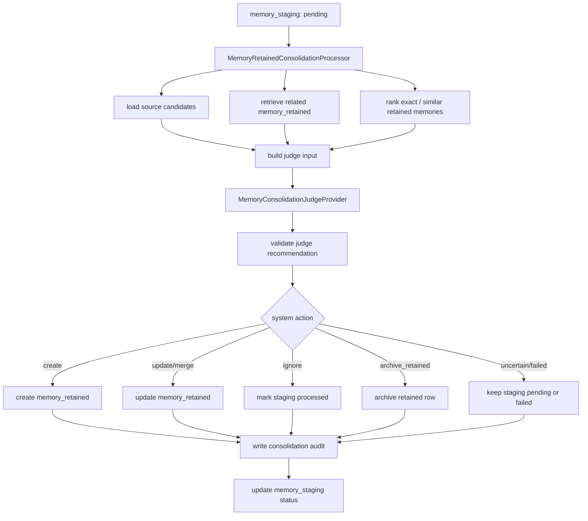

# Memory Write Batch 4 — Memory Retained LLM Consolidation Judge 功能设计

[返回 followups](memory-write-followups.md) ｜ [项目地图（记忆子系统）](../project-map-memory.zh-CN.md)

> 状态：设计草案。本文档取代旧的 candidate-level judge 方案，面向 Batch 3.5 之后的三层 memory pipeline：`memory_candidates` -> `memory_staging` -> `memory_retained`。

## 1. 背景与目标

Batch 3.5 已经把 memory write 拆成三层：

- `memory_candidates`：从聊天 structured output、summarize、未来工具或人工入口保存 raw candidate。
- `memory_staging`：经过规则过滤、normalization、embedding、精确重复聚合后的 evidence 层。
- `memory_retained`：长期保留层，代表可在未来 prompt read injection 中使用的稳定记忆。

当前系统只做到 candidate -> staging。`memory_retained` 已有表、只读 store 和 debug API，但没有写入路径。Batch 4 的目标是实现 staging -> retained 的筛选、合并和保存，让系统能把中间 evidence 沉淀成稳定长期记忆。

Batch 4 重点解决架构问题：LLM 可以参与判断，但 LLM 只能给建议；最终写入、更新、归档、状态迁移、幂等和失败处理由系统层控制。

## 2. 非目标

- 不实现 retained memory prompt read injection；这是 Batch 5。
- 不把 `memory_retained` 作为跨 character 共享记忆；每条 retained memory 继续绑定明确 `userId + characterId`。
- 不让 chat turn service 直接解析 judge 输出或写 retained memory。
- 不恢复旧的 `memory_decisions` candidate 主路径。
- 不在本批次实现人工审核 UI。
- 不要求上线完整后台 worker；但 processor API 要能被未来 worker / debug action 调用。

## 3. 核心架构决议

### 3.1 Batch 4 应落在 memory pipeline 内

新增一个独立 processor：`MemoryRetainedConsolidationProcessor`。

它负责：

1. 拉取待处理的 `memory_staging` evidence。
2. 检索同 bucket 的相关 `memory_retained`。
3. 组装 judge 输入。
4. 调用注入的 `MemoryConsolidationJudgeProvider`。
5. 校验 judge 建议。
6. 由系统层应用 create / update / merge / ignore / archive / importance change。
7. 写入 audit / decision record。
8. 标记 staging 为 processed / archived / failed。

这样 memory core 仍只依赖 ports，不依赖 Express、SQLite SDK、Mistral SDK 或 chat turn 实现。

### 3.2 Processor 不是 `ModelCall`，judge 步骤应该是 purpose-centered `ModelCall`

需要区分两个层次：

- `MemoryRetainedConsolidationProcessor` 是系统流程。它负责拉取 staging、检索 retained、调用 judge、应用系统裁决、写 audit、更新状态。它不应该注册成一个 `ModelCall`。
- “让 LLM 判断这批 staging evidence 应该如何沉淀”的步骤，是一次明确目的的模型调用。它适合被设计成 `ModelCallPurpose = "memory.consolidate"` 对应的 `ModelCall`。

也就是说，Batch 4 不应该绕开 `ModelCallPurpose`。相反，它暴露出当前 `ModelCall` 接口过度贴近 chat turn：`ModelCallRunInput` 固定要求 `PromptContext`、`interactionMode`，而 consolidation judge 的输入是 staging evidence、retained candidates、角色摘要和策略配置。

推荐做法：

- 保留 `chatTurn/chatTurnService` 作为一次聊天回合的系统流程 owner。`chat.main` 的 `ModelCall` 只负责 chat-purpose 的 prompt assembly、structured output schema 和解析。
- 保留 memory pipeline 作为 memory retained consolidation 的系统流程 owner。它通过 memory-owned port 调用 judge，不直接依赖 model-call registry。
- 新增 `memory.consolidate` model call，负责 consolidation judge 的 prompt assembly、structured output schema 和解析。
- 在 composition 层提供一个 adapter，把 `memory.consolidate` 的 `ModelCall` 包装成 `MemoryConsolidationJudgeProvider`，注入 memory processor。

这样 `ModelCallPurpose` 仍然是模型调用边界的中心；`chatTurnService` 和 `MemoryRetainedConsolidationProcessor` 则分别是不同业务流程的 orchestrator。

接口层不建议在 Batch 4 前先做完整重构。当前只有 `chat.main` 一个已落地样本，直接把 `ModelCall` 泛化成全局 `ModelCall<TInput, TParsedOutput>` 容易把未来 public API 设计过早定死。

Batch 4 应采用“小幅边界修正”：

- 现有 `ModelCall` 暂时保留给 chat-purpose 路径使用；语义上可先视为 `ChatModelCall`。
- 为 `memory.consolidate` 新增一个窄的 purpose-specific model call 接口或 adapter，不要求 `PromptContext` 和 `interactionMode`。
- adapter 把 `memory.consolidate` model call 包装成 `MemoryConsolidationJudgeProvider`，供 memory processor 调用。
- 不在 Batch 4 里统一重排所有 `persona-flow` 对外入口。

等 `chat.main` 和 `memory.consolidate` 两个真实样本都跑通后，再回头决定是否把 `ModelCall` 泛化、是否把 registry 从 `purpose + interactionMode` 演进到 `purpose + variant`，以及是否整理 `persona-flow` 的 public service / pipeline API。

关键原则：不要把 `PromptContext` 当成所有 model call 的通用输入；但也不要为了 Batch 4 先做大范围抽象迁移。

中期仍建议把 `ModelRuntime` 中与聊天无关的 provider/model/API-key 解析和 prompt log 能力抽成通用 `ModelGenerationRuntime`，让：

- `chat.main` model call 使用它。
- `memory.consolidate` model call 使用它。
- 未来 `memory.summarize`、`memory.extract`、tool continuation 也使用它。

不要为了 Batch 4 把整个 `MemoryRetainedConsolidationProcessor` 注册成 `memory.consolidate` 的 `ModelCall`。应注册的是 LLM judge 这一步；processor 仍是系统层 pipeline。

### 3.3 新增或明确 model purpose

当前 contracts 已有：

- `chat.main`
- `memory.summarize`
- `memory.embed`

推荐新增 `memory.consolidate`，category 为 `chat`。理由是 consolidation judge 和 summarize 的输出约束、成本、模型选择、日志分析都不同。

若暂时不想改设置 UI，可先复用 `memory.summarize` 的 assignment 作为兼容过渡，但 `ModelCall` 的 purpose 仍建议叫 `memory.consolidate`，并在 runtime resolution 层允许它 fallback 到 `memory.summarize` 的 assignment。这样不会把两个不同目的混成同一个模型调用。

## 4. 数据流



## 5. Processor 输入与触发方式

新增 public entry：

```ts
interface ProcessPendingMemoryStagingInput {
    userId: string;
    characterId: string;
    limit?: number;
}

interface ProcessPendingMemoryStagingResult {
    outcomes: MemoryRetainedConsolidationOutcome[];
}
```

`MemoryPipelineService` 增加：

```ts
processPendingMemoryStaging(input: ProcessPendingMemoryStagingInput): Promise<ProcessPendingMemoryStagingResult>
```

触发策略分两阶段：

- Batch 4 初版：不强制在 chat turn inline 调 judge。由 debug route、脚本或未来 worker 调用 `processPendingMemoryStaging()`。
- 可选配置：`memory.retained.processingMode = "manual" | "inline" | "worker"`。初始默认建议 `manual` 或 `worker` 占位，避免聊天响应被 judge 延迟拖慢。

如果需要快速验证，可以在开发配置里启用 inline，但代码上仍应让 retained processor 与 chat turn 解耦。

## 6. Staging 查询与分批策略

`MemoryStagingStore` 需要扩展：

```ts
interface ListPendingMemoryStagingInput {
    userId: string;
    characterId: string;
    status?: "pending";
    limit: number;
}

interface UpdateMemoryStagingStatusInput {
    memoryStagingId: string;
    status: "processed" | "archived" | "failed" | "pending";
    statusReason?: string;
    updatedAt: string;
}
```

初版不实现复杂 claim/lock。为减少重复处理窗口，processor 应在每条 staging 写 audit 前后保持幂等：如果 staging 已经有成功 consolidation audit，则不重复创建 retained memory，只修复 staging 状态。

未来 worker 化时再补：

- `processing` 状态或 `processingStartedAt`。
- lease timeout。
- retry count。
- dead-letter reason。

## 7. Retained Store 写接口

`MemoryRetainedStore` 从只读扩展为读写：

```ts
interface CreateMemoryRetainedInput {
    id: string;
    userId: string;
    characterId: string;
    scope: MemoryScope;
    type: MemoryCandidateType;
    text: string;
    normalizedText: string;
    relatedEntities: string[];
    tags: string[];
    sourceStagingId?: string;
    status: "active";
    importance: number;
    embedding?: MemoryEmbedding;
    now: string;
}

interface UpdateMemoryRetainedInput {
    memoryRetainedId: string;
    text?: string;
    normalizedText?: string;
    relatedEntities?: string[];
    tags?: string[];
    sourceStagingId?: string;
    importance?: number;
    embedding?: MemoryEmbedding;
    updatedAt: string;
}

interface ArchiveMemoryRetainedInput {
    memoryRetainedId: string;
    statusReason?: string;
    updatedAt: string;
}
```

写入规则：

- create 必须写 embedding；若 embedding 失败，staging 标记 `failed / retained_embedding_failed`，不创建 retained。
- update / merge 改写 text 时必须重新 embedding。
- ignore 不写 retained，只标记 staging `processed / ignored_by_judge`。
- archive 只把 retained row 状态改为 `archived`，不删除。

## 8. Judge Provider Port

memory core 新增端口：

```ts
interface MemoryConsolidationJudgeProvider {
    judge(input: MemoryConsolidationJudgeInput): Promise<MemoryConsolidationJudgeResult>;
}
```

这个 port 是 memory core 的边界，不代表要绕开 `ModelCall`。默认实现应由 composition 层注入，内部调用 `memory.consolidate` 的 purpose model call。memory core 只认识 `MemoryConsolidationJudgeProvider`，不 import `modelCallRegistry`。

输入应只包含 provider-neutral 数据：

- 当前 staging evidence：id、scope、type、text、normalizedText、relatedEntities、tags、occurrenceCount、firstSeenAt、lastSeenAt。
- source candidate 摘要：candidate text、reason、conversationId、message ids、createdAt。数量过多时截断。
- related retained memories：同 `userId + characterId + scope + type` 下 exact/semantic topK retained rows。
- character context：displayName、personaPrompt 摘要、可选 relationship state 摘要。
- policy context：允许的动作、重要度范围、输出 schema 版本。

provider 输出建议：

```ts
type JudgeAction =
    | "create"
    | "update"
    | "merge"
    | "ignore"
    | "archive_retained"
    | "uncertain";

interface MemoryConsolidationJudgeResult {
    action: JudgeAction;
    targetRetainedMemoryId?: string;
    text?: string;
    importance?: number;
    relatedEntities?: string[];
    tags?: string[];
    archiveRetainedMemoryIds?: string[];
    reasoning: string;
    confidence?: number;
    raw?: unknown;
    model?: string;
    requestId?: string;
}
```

## 9. Judge 输出校验与系统裁决

LLM judge 的结果必须经过系统校验。

强制规则：

- `targetRetainedMemoryId` 必须来自本次输入提供的 retained memory 列表。
- `archiveRetainedMemoryIds` 必须来自本次输入提供的 retained memory 列表。
- `create` 必须有非空 `text`。
- `update` / `merge` 必须有合法 `targetRetainedMemoryId` 和非空 `text`。
- `ignore` 不允许携带新 text。
- `importance` 必须落在配置范围内，例如 `0..1` 或 `1..5`，项目应统一一个尺度。
- judge 不能修改 `userId`、`characterId`、`scope`、`type`。

无效输出处理：

- 不写 retained。
- 写 audit：`action = "uncertain"`，`statusReason = "invalid_judge_output"`。
- staging 保持 `pending` 或标记 `failed`，由配置决定。初版建议标记 `failed`，避免无限重试同一非法输出。

## 10. Consolidation Audit

Batch 4 需要新的 audit 表或 store，不复用旧 `memory_decisions`。

建议表名：`memory_consolidation_decisions`。

用途：记录每条 staging 被如何处理，便于 debug、幂等和重放。

核心字段：

- `id`
- `user_id`
- `character_id`
- `memory_staging_id`
- `action`
- `target_retained_memory_id`
- `created_retained_memory_id`
- `archived_retained_memory_ids_json`
- `judge_request_json`：可截断，不保存过长原文。
- `judge_response_json`：原始 structured output。
- `validated_action_json`：系统校验后的动作。
- `status`：`applied` / `rejected` / `failed`。
- `status_reason`
- `model_call_purpose`
- `model`
- `request_id`
- `created_at`

幂等规则：

- 同一 `memory_staging_id` 只能有一个 `applied` decision。
- processor 启动时先查 applied decision；若存在，则不重复调用 judge，不重复写 retained，只修复 staging 状态。

Debug API 后续新增：

- `GET /v1/debug/memory-consolidation-decisions`
- 支持 `characterId`、`memoryStagingId`、`action`、`status`、`limit`。

## 11. Retained Retrieval for Consolidation

Batch 4 的 retrieval 不是 prompt read injection，而是 judge 的候选上下文。

初版 retrieval 策略：

1. 只查同 `userId + characterId + scope + type` 的 `active` retained memory。
2. 用 retained embedding 与 staging embedding 做 cosine similarity。
3. 过滤 embedding signature 不兼容的 retained rows。
4. 取 topK，并额外带上 normalized text exact match。
5. 如果没有 embedding 或签名不兼容，降级为 recent/listLimit 截断，不做相似度排序。

配置建议：

```ts
retained: {
    enabled: boolean;
    processingMode: "manual" | "inline" | "worker";
    batchLimit: number;
    retrieval: {
        topK: number;
        listLimit: number;
        minSimilarityForJudgeContext?: number;
    };
    judge: {
        enabled: boolean;
        maxSourceCandidates: number;
        maxRetainedForPrompt: number;
        maxTextChars: number;
    };
}
```

## 12. Prompt / Structured Output 设计

Judge prompt 固定为系统级任务，不继承角色扮演语气。

System prompt 原则：

- 你是保守的长期记忆整理器。
- staging 是 evidence，不一定值得长期保存。
- retained 是稳定事实，应简洁、中性、可长期使用。
- 不要发明事实，不要发明 ID。
- 只能引用输入列表中的 retained memory id。
- 不确定时输出 `uncertain`。

Structured output schema 应放在 `packages/persona-flow/src/memory/consolidation/`，不放 contracts，除非前端也需要直接校验 judge 输出。

输出字段建议：

```json
{
  "action": "create | update | merge | ignore | archive_retained | uncertain",
  "targetRetainedMemoryId": "optional string",
  "text": "optional string",
  "importance": "optional number",
  "relatedEntities": ["optional string"],
  "tags": ["optional string"],
  "archiveRetainedMemoryIds": ["optional string"],
  "reasoning": "string",
  "confidence": "optional number"
}
```

## 13. 与 Embedding 的关系

Batch 4 继续使用 `memory.embed` 生成 retained embedding。

规则：

- create retained：embed judge/system 最终采用的 text。
- update / merge retained：对合并后的 text 重新 embed。
- ignore / uncertain：不 embed。
- archive：不 embed。

如果 judge 返回 text，但 embedding 失败，不应用该动作。audit 记录 `failed / retained_embedding_failed`。

## 14. Fail-soft 与重试

Batch 4 不能破坏聊天主流程。

- 如果 retained consolidation 是手动或 worker 触发，失败只影响本次 processor result。
- 如果开发模式启用 inline，失败也不能向 chat turn 抛出。
- judge provider 异常、schema 校验失败、target id 非法、store 写失败都要写 audit 或 log。

推荐状态：

- judge 暂时失败：staging `failed / judge_failed`。
- judge 不确定：staging `processed / judge_uncertain`，audit `rejected` 或 `applied` 需统一。建议 audit status 用 `applied` 表示系统已应用“暂不沉淀”的裁决。
- store 写失败：staging `failed / retained_store_failed`。
- embedding 失败：staging `failed / retained_embedding_failed`。

## 15. 代码落点

领域层：

- `packages/persona-flow/src/memory/consolidation/MemoryRetainedConsolidationProcessor.ts`
- `packages/persona-flow/src/memory/consolidation/consolidationTypes.ts`
- `packages/persona-flow/src/memory/consolidation/consolidationPorts.ts`
- `packages/persona-flow/src/memory/stores/memoryRetainedStorePort.ts`
- `packages/persona-flow/src/memory/staging/memoryStagingPorts.ts`
- `packages/persona-flow/src/memory/settings.ts`
- `packages/persona-flow/src/memory/MemoryPipelineService.ts`
- `packages/persona-flow/src/memory/createMemoryPipelineService.ts`

Model call 层：

- `packages/persona-flow/src/modelCall/memory.consolidate/memoryConsolidateCall.ts`
- `packages/persona-flow/src/modelCall/memory.consolidate/memoryConsolidateInput.ts`
- `packages/persona-flow/src/modelCall/memory.consolidate/consolidationOutputSchema.ts`
- `packages/persona-flow/src/modelCall/memory.consolidate/consolidationPromptBuilder.ts`
- `packages/persona-flow/src/modelCall/memory.consolidate/MemoryConsolidationJudgeProviderAdapter.ts`
- `packages/persona-flow/src/modelCall/modelCallRegistry.ts`
- 视实现范围调整 `packages/persona-flow/src/modelCall/modelCall.ts`，让 `ModelCall` 支持 purpose-specific input。

SQLite 适配层：

- `packages/persona-flow-sqlite/src/db/schema.ts`
- `packages/persona-flow-sqlite/src/db/openDatabase.ts`
- `packages/persona-flow-sqlite/src/db/SQLiteMemoryRetainedStore.ts`
- `packages/persona-flow-sqlite/src/db/SQLiteMemoryStagingStore.ts`
- 新增 `SQLiteMemoryConsolidationDecisionStore.ts`
- `packages/persona-flow-sqlite/src/createSqliteStores.ts`

Server / contracts：

- `packages/contracts/src/modelCallPurpose.ts`：如采用清晰方案，新增 `memory.consolidate`。
- `packages/contracts/src/apis/memory.api.ts`：新增 debug API DTO。
- `apps/server/src/util/config.ts`
- `apps/server/schemas/config.schema.json`
- `apps/server/src/http/apis/memoryDebug.route.ts`

## 16. 测试策略

领域单测优先：

- staging 无相关 retained -> judge create -> 创建 retained，staging processed，audit applied。
- staging 与 retained 重复 -> judge ignore -> 不创建 retained，staging processed，audit applied。
- judge update/merge -> retained text 和 embedding 更新，audit 记录 target id。
- judge 返回非法 target id -> 不写 retained，staging failed，audit rejected。
- embedding 失败 -> 不写 retained，staging failed，audit failed。
- processor 重跑已 applied staging -> 不重复调用 judge，不重复写 retained。

SQLite adapter tests：

- retained create / update / archive。
- consolidation decision unique applied 约束。
- staging status update。

Server/config tests：

- `memory.retained` 新配置默认值合并。
- `memory.consolidate` assignment、fallback 到 `memory.summarize` assignment（若采用过渡策略）、config schema 和 availableModels category 校验通过。

## 17. 推荐实施顺序

1. 扩展 contracts purpose，新增 `memory.consolidate`，并同步 settings / config schema。
2. 扩展 retained / staging / consolidation decision ports。
3. 实现 SQLite store 写接口和 audit 表。
4. 做最小边界修正：为 `memory.consolidate` 新增窄的 purpose-specific model call 接口或 adapter；不先泛化整个 `ModelCall`。
5. 实现 `memory.consolidate` model call：prompt builder、structured output schema、parsed output。
6. 实现把 `memory.consolidate` model call 适配为 `MemoryConsolidationJudgeProvider` 的 adapter。
7. 实现 `MemoryRetainedConsolidationProcessor`，先用 fake judge 写领域单测。
8. 接入 `createMemoryPipelineService` 和 `MemoryPipelineService.processPendingMemoryStaging()`。
9. 增加 debug API 手动触发或只读查看 decision。
10. 最后再评估是否允许 inline consolidation，以及是否需要启动完整 `persona-flow` public API / `ModelCall` 重构。

## 18. 暂定结论

Batch 4 不应把整个 memory processor 做成 `ModelCall`，但应该把 LLM judge 这一步做成 purpose-centered `ModelCall`。更稳的边界是：pipeline / processor 层拥有业务流程，model-call 层拥有单次模型调用定义。

实施上先做“小幅边界修正 + Batch 4”，不要先完成整个 `persona-flow` 重构。Batch 4 会提供 chat 以外的第一个真实 model-call 样本；等 `chat.main` 与 `memory.consolidate` 都稳定后，再基于真实差异设计完整的 `ModelCall`、registry 和 public pipeline API。
