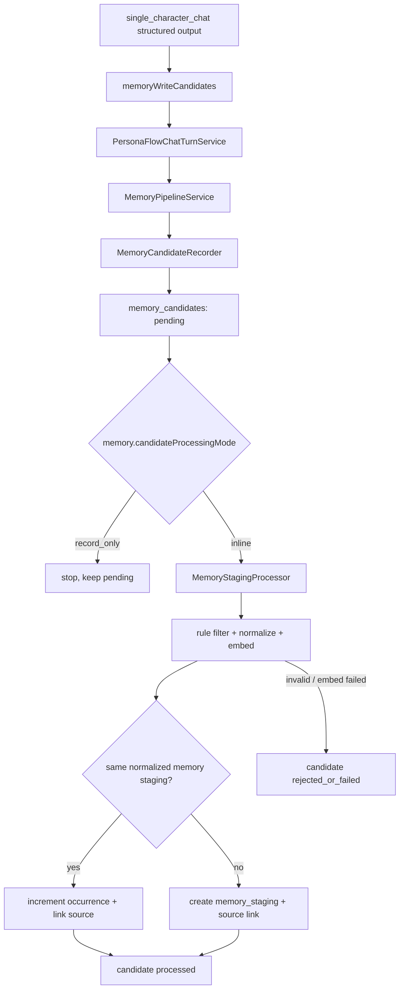

# Project Map - Memory 子系统

[返回项目地图](project-map.zh-CN.md)

本文档是 `docs/project-map.zh-CN.md` 拆出的 memory 子系统说明。主项目地图只保留 memory 的入口级介绍；这里记录 Batch 3.5 后的 memory pipeline 设计思路、运行时配置、数据表、状态机、核心实现位置，以及接下来要做但尚未实现的 LLM consolidation。

当前状态一句话：`single_character_chat` 可以在 structured output 中提交 `memoryWriteCandidates`；chat turn 持久化 assistant 回复后会把这些候选交给 `MemoryPipelineService`。默认配置下，系统会记录 raw candidate，并在 inline 模式下把 candidate 处理成 `memory_staging` evidence。Batch 3.5 不写 `memory_retained`，也不做 LLM judge / prompt read injection，因此现在仍不是完整 RAG 闭环。

## 核心设计思路

Batch 3.5 的核心重构是把旧的“candidate 直接加工并尝试写 active memory / decision”的链路拆成三层：

1. `memory_candidates`：原始候选层，只负责保存模型、summarize、未来工具或人工入口提交的候选事实，以及处理状态。
2. `memory_staging`：中间 evidence 层，保存经过规则过滤、normalization、embedding 后的候选记忆。它可以保留近期、未沉淀、未合并的信息，并允许一定冗余。
3. `memory_retained`：长期保留层，代表将来经过 LLM consolidation / persona-aware 判断后可长期使用、可注入 prompt 的稳定记忆。Batch 3.5 只建表和只读 store，不写入。

这套拆分的理由：

- **采集与沉淀分离**：chat model 只提出“可能值得记住”的候选，不需要立刻决定长期价值。
- **低成本处理先行**：candidate -> memory staging 可以在 chat turn 后 inline 做规则过滤、embedding、精确重复聚合；昂贵的 LLM consolidation 推迟到 Batch 4。
- **保留证据链**：`memory_staging_sources` 记录每条 staging evidence 来自哪些 candidate，便于 debug、幂等重跑和未来 LLM judge 查看证据。
- **避免 candidate processor 过载**：Batch 3.5 后 processor 不再直接写 retained memory，也不再写旧 `memory_decisions`。
- **fail-soft**：memory pipeline 失败不能破坏 chat turn；失败通过 candidate status、statusReason 和 warning log 体现。

## 当前数据流



重要边界：

- streaming preview 不消费 memory candidates；它只从 structured-output JSON 中的 `replyText` / turn events 生成预览。
- memory candidates 只在 model call 完成并解析出最终 structured output 后处理。
- `record_only` 只写 `memory_candidates`，不生成 embedding，不写 `memory_staging`。
- `inline` 会在同一次 chat turn 里处理当前写入成功的 candidates。
- `processPendingCandidates()` 也可以被未来 worker / debug action 调用，用同一个 processor 拉取 pending rows。

## 运行时配置

服务端配置文件位于 `apps/server/config/*.json`，schema 位于 `apps/server/schemas/config.schema.json`，加载逻辑位于 `apps/server/src/util/config.ts`。领域默认值位于 `packages/persona-flow/src/memory/settings.ts`。

当前 memory 配置形状：

```ts
memory: {
  enabled: boolean;
  candidateProcessingMode: "inline" | "record_only";
  staging: {
    enabled: boolean;
    candidateBatchLimit: number;
    duplicate: {
      normalizedText: boolean;
    };
    similaritySampling: {
      enabled: boolean;
      listLimit: number;
      topK: number;
    };
  };
  retained: {
    enabled: boolean;
    retrieval: {
      topK: number;
      listLimit: number;
    };
  };
}
```

### `memory.enabled`

- 类型：`boolean`
- 默认：`true`
- 作用：memory 总开关。为 `false` 时，`MemoryPipelineService` 跳过本回合所有 memory 工作，不写 candidate，也不处理 staging；chat turn 仍正常完成。

### `memory.candidateProcessingMode`

- 类型：`"inline" | "record_only"`
- 默认：`"inline"`
- `inline`：assistant turn 持久化后，记录 candidates，并立即处理成 memory staging。
- `record_only`：只记录 candidates，保留为 `pending`，等待未来 worker / debug action / 人工工具触发。

### `memory.staging.enabled`

- 类型：`boolean`
- 默认：`true`
- 作用：控制 candidate -> memory staging 处理。若为 `false`，pipeline 仍可记录 candidates，但不会执行 embedding / staging 写入。

### `memory.staging.candidateBatchLimit`

- 类型：`number`
- 默认：`50`
- 作用：`processPendingCandidates()` 未显式传入 limit 时，一次最多拉取多少 pending candidates。inline 模式通常直接处理当前 turn 的 accepted candidates，不主要依赖这个值。

### `memory.staging.duplicate.normalizedText`

- 类型：`boolean`
- 默认：`true`
- 作用：是否把同一 `userId + characterId + scope + type + normalizedText` 下的 candidates 聚合到同一条 memory staging。
- 为 `true` 时，重复 candidate 会增加 `occurrenceCount`，并新增 `memory_staging_sources` link。
- 为 `false` 时，每条有效 candidate 都会创建新的 memory staging。

### `memory.staging.similaritySampling.enabled`

- 类型：`boolean`
- 默认：`true`
- 作用：是否对同 bucket 已有 memory staging 做 embedding similarity sampling。Batch 3.5 中这只用于日志观察，不影响是否聚合、创建或拒绝。

### `memory.staging.similaritySampling.listLimit`

- 类型：`number`
- 默认：`500`
- 作用：每次 sampling 最多读取多少条同 bucket `pending` memory staging。

### `memory.staging.similaritySampling.topK`

- 类型：`number`
- 默认：`10`
- 作用：similarity sampling 日志中最多保留多少条 top matches。

### `memory.retained.enabled`

- 类型：`boolean`
- 默认：`false`
- 作用：预留给 Batch 4 的 memory retained consolidation。Batch 3.5 不写 retained rows，因此该开关目前不会启动 LLM judge。

### `memory.retained.retrieval.topK` / `memory.retained.retrieval.listLimit`

- 类型：`number`
- 默认：`topK = 10`，`listLimit = 500`
- 作用：预留给未来 retained retrieval / consolidation。Batch 3.5 只保留配置形状。

### `embedding.version`

`embedding.version` 仍是 `DEFAULT_MEMORY_SETTINGS` 中的代码默认值，目前不暴露到 server JSON。它参与 embedding signature，文本预处理、包装方式或向量策略变化时可提升版本，避免新旧向量混比。

embedding 使用的模型不是 `memory` 配置项，而是 model assignment 体系的一部分：

- 固定 purpose：`memory.embed`
- 默认配置：`defaultModelAssignments["memory.embed"]`
- 用户覆盖：user preferences 中的 `modelAssignments["memory.embed"]`
- 可选模型列表：`models[provider].availableModels.embed`
- API key 解析：用户 credential 优先，其次 `models[provider].apiKey`

## SQLite 表与用途

Batch 3.5 的 memory 相关表在 `packages/persona-flow-sqlite/src/db/schema.ts` 和 `openDatabase.ts` 中定义 / 创建。

当前表：

- `memory_candidates`
- `memory_staging`
- `memory_staging_sources`
- `memory_retained`

旧表：

- `memories`：已由 `memory_retained` 取代，启动时可直接 drop。
- `memory_decisions`：Batch 3.5 主路径移除；未来 Batch 4 会重新设计 memory retained consolidation decisions。

### `memory_candidates`

用途：保存模型提交的 raw memory candidate，以及 candidate -> staging 处理状态。它不再保存 normalized text 或 embedding。

重要 columns：

- `id`：candidate id。
- `user_id` / `character_id` / `conversation_id`：来源上下文。
- `user_message_id` / `assistant_message_id`：对应 chat turn。
- `request_id`：model request id。
- `model_call_purpose`：通常是 `chat.main`。
- `seq`：该 assistant turn 内第几条 candidate，0-based。
- `scope`：memory scope，来自 contracts。
- `type`：candidate type，来自 contracts。
- `text`：模型提交的候选文本。
- `related_entities_json` / `tags_json`：模型提交的结构化辅助信息。
- `candidate_reason`：模型为什么提出这条 candidate。
- `status`：candidate 当前处理状态。
- `status_reason`：processor 给出的处理结果原因。
- `schema_version` / `created_at` / `updated_at`：schema 与审计字段。

状态值：

- `pending`：刚写入，尚未处理。
- `processing`：预留给未来 worker claim / lock；Batch 3.5 inline 处理不写这个状态。
- `processed`：已成功关联到 memory staging，包括新建、重复聚合或幂等重跑修复。
- `rejected_by_rule`：被确定性规则拒绝，例如空文本、归一化后为空、纯标点、低信号文本。
- `failed`：非确定性处理失败，例如 embedding provider 或 staging store 失败，可由未来 worker 重试。

常见 `status_reason`：

- `staging_created`
- `staging_duplicate_normalized_text`
- `idempotent_already_linked`
- `embedding_failed`
- `staging_create_failed`
- `staging_link_failed`
- `empty_after_normalize`
- `too_short_no_signal`
- `punctuation_only`
- `unexpected_error`

### `memory_staging`

用途：保存 candidate 经过规则过滤、normalization、embedding 后形成的中间 evidence。它不是长期记忆，也不代表应该注入 prompt。

重要 columns：

- `id`：memory staging id。
- `user_id` / `character_id`：绑定到一个用户和一个角色世界。
- `scope` / `type`：和 candidate 一致，用于 bucket 查询。
- `text`：当前 staging 文本。Batch 3.5 直接使用 candidate text。
- `normalized_text`：`normalizeMemoryText()` 产物，用于精确重复聚合。
- `related_entities_json` / `tags_json`：从 candidate 带入。
- `status`：staging 生命周期状态。
- `status_reason`：staging 创建或后续处理原因。
- `occurrence_count`：有多少 distinct candidates 聚合到这条 staging。
- `first_seen_at`：第一条 source candidate 的创建时间。
- `last_seen_at`：最近一次聚合的处理时间。
- `embedding_json`：完整 `MemoryEmbedding` JSON，包括 vector 和 signature。
- `schema_version` / `created_at` / `updated_at`。

状态值：

- `pending`：Batch 3.5 主要写入状态，表示等待未来 memory retained consolidation。
- `processed`：预留给 Batch 4 consolidation 成功。
- `archived`：预留给“已沉淀或被替代，不再参与后续处理”。
- `forgotten`：预留给显式遗忘。
- `failed`：预留给 staging record 生成后发生不可恢复错误的情况。

Batch 3.5 不允许创建无 embedding 的 memory staging。embedding 失败时 candidate 标记为 `failed / embedding_failed`，并输出 warning log。

### `memory_staging_sources`

用途：保存 candidate 和 memory staging 的来源关系，即“哪条 candidate 贡献到了哪条 memory staging”。这不是新的 memory 层，而是 evidence / debug / 幂等关系表。

重要 columns：

- `memory_staging_id`：目标 memory staging id。
- `candidate_id`：source candidate id。
- `candidate_seq`：source candidate 在 assistant turn 内的序号快照。
- `created_at`：link 创建时间。

约束：

- composite primary key：`(memory_staging_id, candidate_id)`。
- `candidate_id` unique：同一 candidate 只能贡献到一条 memory staging。

作用：

- 支持幂等重跑：如果 staging row 和 source link 已写入，但 candidate 状态更新失败，下次处理可以通过 `candidate_id` 找回 staging，并修复 candidate 状态。
- 支持 occurrence evidence：多个 candidates 聚合到同一 staging 时，`memory_staging.occurrence_count` 给计数，source 表给证据链。
- 支持 debug：从 candidate 追溯到 staging，或从 staging 查看来源 candidates。

### `memory_retained`

用途：保存未来经过 Batch 4 LLM consolidation 后的长期记忆。Batch 3.5 只建表、只读 store 和 debug API，不写入。

重要 columns：

- `id`：retained memory id。
- `user_id` / `character_id`：绑定到一个用户和一个角色世界。
- `scope` / `type`：memory 分类。
- `text`：长期记忆文本。
- `normalized_text`：用于 future exact lookup / merge。
- `related_entities_json` / `tags_json`。
- `source_staging_id`：来源 memory staging id，可为空，预留给人工或 judge-driven 插入。
- `status`：`active` / `archived`。
- `importance`：重要度，Batch 4 之后使用。
- `embedding_json`：retained memory embedding。
- `schema_version` / `created_at` / `updated_at`。

状态值：

- `active`：可参与未来 retrieval / prompt injection 的长期记忆。
- `archived`：已归档，不默认参与 retrieval。

## Debug API

Contracts 位于 `packages/contracts/src/apis/memory.api.ts`，server route 位于 `apps/server/src/http/apis/memoryDebug.route.ts`。

当前只读 endpoints：

- `GET /v1/debug/memory-candidates`
  - 查询当前用户的 candidates。
  - 支持 `characterId`、`conversationId`、`assistantMessageId`、`status`、`limit`。

- `GET /v1/debug/memory-staging`
  - 查询当前用户的 memory staging rows。
  - 支持 `characterId`、`scope`、`type`、`status`、`sourceCandidateId`、`limit`。
  - 返回 embedding signature，不返回 raw vector。

- `GET /v1/debug/memory-retained`
  - 查询当前用户某个 character 的 retained rows。
  - `characterId` 必填。
  - 支持 `scope`、`type`、`status`、`limit`。

旧 `/v1/debug/memory-decisions` 已移除。Batch 4 如果需要 consolidation decision replay，会新增新的 memory retained consolidation decision API，而不是复用旧 decision 表。

## 代码边界与实现位置

核心领域代码位于：

- `packages/persona-flow/src/memory/**`

该目录保持 framework-free，不依赖 Express、SQLite SDK、Mistral SDK 或具体 HTTP API。

主要文件：

- `MemoryPipelineService.ts`
  - memory 子系统顶层入口。
  - 负责 `memory.enabled`、`candidateProcessingMode`、`staging.enabled` 的路径选择。
  - 调用 recorder 和 staging processor。
  - 所有失败 fail-soft，不向 chat turn 抛出 memory 错误。

- `createMemoryPipelineService.ts`
  - 从 `AppStores`、`ModelClient`、settings、logger、clock 和 id generator 组装 memory pipeline。
  - 把 `ModelClientMemoryEmbeddingProvider` 接到 `MemoryEmbeddingStep`。

- `settings.ts`
  - 定义 `MemorySettings`、`MemoryStagingSettings`、`MemoryRetainedSettings` 和 `DEFAULT_MEMORY_SETTINGS`。

- `candidate/MemoryCandidateRecorder.ts`
  - 过滤空候选、生成 id / seq、把 raw candidates 写入 candidate store。
  - 不做 normalization、embedding、低价值判断或 memory decision。

- `candidate/candidateTypes.ts`
  - candidate record 和 status 定义。

- `candidate/candidatePorts.ts`
  - candidate store port：append、list、listPending、updateCandidateStatus。

- `candidate/textNormalization.ts`
  - `normalizeMemoryText()`，用于 memory staging exact duplicate key。

- `staging/MemoryStagingProcessor.ts`
  - Batch 3.5 主 processor。
  - 流程：idempotency check -> low-value filter -> normalize -> embed -> exact normalized duplicate -> create / link / increment -> candidate terminal status。
  - embedding 失败时只标 candidate failed，不创建 memory staging。
  - idempotent 分支会修复 candidate 状态，防止 pending 无限重扫。

- `staging/memoryStagingTypes.ts`
  - memory staging record、source link record 和 staging statuses。

- `staging/memoryStagingPorts.ts`
  - staging store port：findBySourceCandidate、findExact、create、linkSource、incrementOccurrence、list。

- `stores/memoryRetainedStorePort.ts`
  - memory retained record、statuses 和只读 list port。Batch 4 会扩展 create / update / archive 等写接口。

- `embedding/MemoryEmbeddingStep.ts`
  - 包装 embedding provider 调用。
  - 记录 `embedding_requested`、`embedding_completed`、`embedding_failed`。
  - 失败 warning payload 包含 candidateId、userId、characterId、scope、type、reason。

- `embedding/ModelClientMemoryEmbeddingProvider.ts`
  - 使用 `memory.embed` purpose 解析 model assignment / API key，并调用 `ModelClient.embed()`。

- `ranking/similarity.ts`
  - cosine similarity、embedding signature 比较、skip breakdown 工具。

- `ranking/rankSimilarMemories.ts`
  - retained memory ranking 预留 / 测试工具；Batch 3.5 staging sampling 在 processor 内部直接按 staging record 形状计算。

- `decision/decisionPolicy.ts`
  - 保留 deterministic low-value filter 和 similarity decision policy。
  - LLM judge 不放在这里；Batch 4 会在 consolidation processor / provider 层设计。

- `logging/MemoryPipelineLogger.ts`
  - memory pipeline 结构化日志入口。

- `logging/memoryPipelineLogEvents.ts`
  - memory pipeline 事件名常量。

SQLite 适配代码：

- `packages/persona-flow-sqlite/src/db/schema.ts`
- `packages/persona-flow-sqlite/src/db/openDatabase.ts`
- `packages/persona-flow-sqlite/src/db/SQLiteMemoryCandidateStore.ts`
- `packages/persona-flow-sqlite/src/db/SQLiteMemoryStagingStore.ts`
- `packages/persona-flow-sqlite/src/db/SQLiteMemoryRetainedStore.ts`
- `packages/persona-flow-sqlite/src/createSqliteStores.ts`

Server / contracts：

- `packages/contracts/src/apis/memory.api.ts`
- `apps/server/src/http/apis/memoryDebug.route.ts`
- `apps/server/src/util/config.ts`
- `apps/server/schemas/config.schema.json`

## 核心机制

### Candidate intake

`MemoryCandidateRecorder` 只保存 raw candidate。它会 trim / reject empty text、生成 id、维护同一 assistant turn 内的 `seq`，然后调用 candidate store。

candidate store 异常会被 recorder 捕获并返回 `storeError`；`MemoryPipelineService` 会记录 pipeline failure，但 chat turn 不失败。

### Text normalization

`normalizeMemoryText()` 用于 exact duplicate key，不是展示文本，也不是语义相似度算法。它会做 Unicode NFKC、常见空白和引号折叠、小写化、空白合并和 trim。

### Low-value filter

`isLowValueCandidate()` 只拒绝明显无效内容，例如空文本、过短无信号文本、纯标点。它不判断长期价值。

### Embedding

`MemoryEmbeddingStep` 调用 `ModelClientMemoryEmbeddingProvider`。embedding signature 包含：

- `provider`
- `model`
- `dim`
- `version`
- `createdAt`

Batch 3.5 中 memory staging 必须有 embedding。embedding 失败时：

- candidate -> `failed`
- statusReason -> `embedding_failed`
- 不创建 memory staging
- 输出 warning log

### Exact duplicate / occurrence aggregation

Batch 3.5 只自动聚合 normalized text 完全相同的 memory staging。

匹配条件：

- `userId`
- `characterId`
- `scope`
- `type`
- `normalizedText`

命中时：

- 不创建新 memory staging。
- 写入 `memory_staging_sources` link。
- `occurrenceCount += 1`。
- 更新 `lastSeenAt` / `updatedAt`。
- candidate -> `processed / staging_duplicate_normalized_text`。

### Similarity sampling

Batch 3.5 会可选地对同 bucket memory staging 做 embedding similarity sampling，但 sampling 只写日志，不参与决策。

这用于观察真实数据中 near-duplicate 的 similarity baseline，为 Batch 4 consolidation 的阈值和 prompt 输入规模提供证据。

### Idempotency

processor 每次处理 candidate 前先调用 `stagingStore.findBySourceCandidate(candidateId)`。

如果找到了 source link，说明该 candidate 已经贡献过 memory staging。processor 会：

- 不重复创建 staging。
- 不重复增加 occurrenceCount。
- 修复 candidate 状态为 `processed / idempotent_already_linked`。

这覆盖了“staging row + source link 已写入，但 candidate 状态更新失败”的部分失败窗口。

### Character binding

每条 memory candidate、staging、retained 都绑定到明确 `characterId`。`scope` 只是在同一 character 世界内部分类，不会让 memory 跨 character 共享。

## 日志

memory 日志集中在 `packages/persona-flow/src/memory/logging/**`。阶段代码只调用 `MemoryPipelineLogger` 的命名方法，不直接拼事件名。

当前事件包括：

- pipeline start / skip / complete / failure
- candidates recorded / recording failed
- candidate processing started / completed / failed
- low-value rejected
- exact duplicate found
- embedding requested / completed / failed
- similarity ranked
- similarity signature mismatch
- memory created / create failed

日志等级：

- `debug`：记录 pipeline 阶段事件和关键计数。
- `warn`：记录 pipeline failure、candidate processing failure、embedding failure 等异常。
- `verbose`：预留给更重的 evidence 日志；Batch 3.5 similarity sampling 当前复用 `similarityRanked` debug 事件。

## 已完成

- `single_character_chat` structured output 支持 `memoryWriteCandidates`。
- chat turn 持久化 assistant turn 后触发 memory pipeline。
- `memory.enabled` / `memory.candidateProcessingMode` / `memory.staging` / `memory.retained` 接入 server runtime config。
- candidate intake 和 candidate store 已拆为 raw candidate 层。
- candidate -> memory staging processor 已实现。
- memory staging exact duplicate aggregation 已实现。
- `memory_staging_sources` source relation 和幂等重跑已实现。
- embedding provider 已通过 `memory.embed` 接入 model assignment 和 `ModelClient.embed()`。
- SQLite stores 已覆盖 `memory_candidates`、`memory_staging` / `memory_staging_sources`、`memory_retained`。
- debug API 已覆盖 candidates、memory staging、memory retained。
- 旧 `memory_decisions` debug API 已移除。
- persona-flow、persona-flow-sqlite、server 的相关 tests / typecheck 已通过。

## 尚未实现 / 下一步

- Batch 4：memory staging -> memory retained 的 LLM consolidation judge 尚未实现。
- 尚未新增独立 model call / provider port 给 LLM judge；当前只有 `chat.main` 和 embedding 使用的 `memory.embed`。
- 尚未设计 consolidation decision 表；旧 `memory_decisions` 不再作为 Batch 3.5 主路径使用。
- `memory_retained` 目前只读，不写入。
- retained memory 尚未回读进 prompt。
- `record_only` 还没有后台 worker / queue consumer。
- 没有人工审核 UI。
- 没有 merge / update / archive / forget 的 retained memory 状态机实现。
- 没有 `memory_debug_events` 表。
- similarity sampling 只用于观察，不做自动 merge。

Batch 4 的方向：从 `memory_staging` 拉取 pending evidence，查询相关 `memory_retained`，把 staging evidence、已有 retained memory、角色设定和关系状态交给 persona-aware LLM consolidation judge，由系统层应用 create / update / merge / ignore / archive / importance bump 等结果。这个阶段会重新定义 LLM 输入输出 schema、model call purpose、decision audit 和重试策略。
