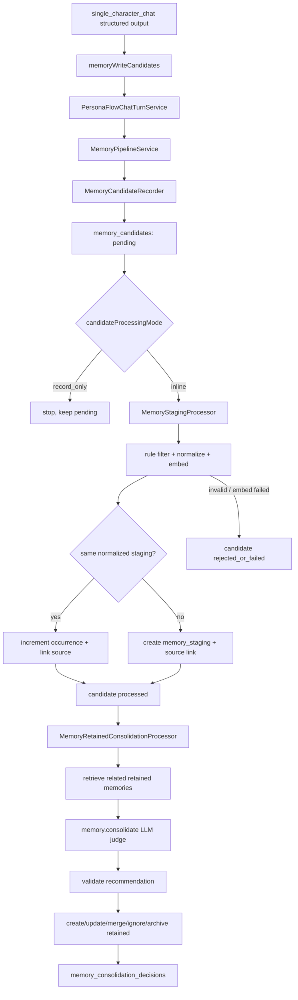

# Project Map - Memory 子系统

[返回项目地图](project-map.zh-CN.md)

本文档是 `docs/project-map.zh-CN.md` 拆出的 memory 子系统说明。主项目地图只保留入口级介绍；这里记录当前长期记忆保存链路、运行时配置、数据表、核心实现位置，以及下一步要做的调试调校工具和 prompt/query 注入。

当前状态一句话：`single_character_chat` 可以在 structured output 中提交 `memoryWriteCandidates`；chat turn 持久化 assistant 回复后会把这些候选交给 `MemoryPipelineService`。系统会记录 raw candidate、处理成 embedded staging evidence，并通过 `memory.consolidate` LLM judge 把稳定事实保存为 `memory_retained`，同时写入 consolidation decision audit。Retained memories 还没有回读进 prompt，下一步是 Memory Lab 调试调校工具、重要长期记忆注入和 query 工具。

## 核心设计思路

memory write path 分成三层：

1. `memory_candidates`：原始候选层，保存模型、summarize、未来工具或人工入口提交的候选事实，以及处理状态。
2. `memory_staging`：中间 evidence 层，保存经过规则过滤、normalization、embedding 后的候选记忆。它可以保留近期、未沉淀、未合并的信息，并允许一定冗余。
3. `memory_retained`：长期保留层，保存经过 LLM consolidation / persona-aware 判断后可长期使用、未来可注入 prompt 的稳定记忆。

这套拆分的理由：

- **采集与沉淀分离**：chat model 只提出“可能值得记住”的候选，不需要立刻决定长期价值。
- **低成本处理先行**：candidate -> memory staging 在 chat turn 后可以 inline 做规则过滤、embedding、精确重复聚合。
- **LLM judge 只给建议**：`memory.consolidate` model call 负责 prompt assembly、structured output schema 和 judge response parsing；`MemoryRetainedConsolidationProcessor` 负责校验建议、应用系统决策、写 retained rows 和 audit。
- **保留证据链**：`memory_staging_sources` 记录每条 staging evidence 来自哪些 candidates，`memory_consolidation_decisions` 记录 judge request / response / validated action / applied result，便于 debug、幂等重跑和未来调校工具展示。
- **pipeline 和 model call 分层**：chat turn、candidate processing、retained consolidation 都是业务流程入口；`chat.main`、`memory.consolidate`、`memory.embed` 是按 purpose 定义的一次模型调用。
- **fail-soft**：memory pipeline 失败不能破坏 chat turn；失败通过 status、statusReason、audit row 和 warning log 体现。

## 当前数据流



重要边界：

- streaming preview 不消费 memory candidates；它只从 structured-output JSON 中的 `replyText` / turn events 生成预览。
- memory candidates 只在 model call 完成并解析出最终 structured output 后处理。
- `record_only` 只写 `memory_candidates`，不生成 embedding，不写 `memory_staging`。
- `inline` 会在同一次 chat turn 里处理当前写入成功的 candidates。
- `processPendingCandidates()` 可以被 worker / debug action 调用，用同一个 processor 拉取 pending candidates。
- `processPendingMemoryStaging()` 处理 pending staging evidence，把可保留事实沉淀进 `memory_retained`。
- Retained memories 尚未注入 prompt；当前 memory 系统完成了保存和审计链路，但读取闭环仍在下一步。

## 运行时配置

服务端配置文件位于 `apps/server/config/*.json`，schema 位于 `apps/server/schemas/config.schema.json`，加载逻辑位于 `apps/server/src/util/config.ts`。领域默认值位于 `packages/persona-flow/src/memory/settings.ts`。

当前 memory 配置概念形状：

```ts
memory: {
  enabled: boolean;
  candidateProcessingMode: "inline" | "record_only";
  staging: {
    enabled: boolean;
    duplicate: {
      normalizedText: boolean;
    };
    similaritySampling: {
      enabled: boolean;
      listLimit: number;
      topK: number;
    };
  };
  retained: {
    enabled: boolean;
    processingMode: "manual" | "inline" | "worker";
    retrieval: {
      topK: number;
      listLimit: number;
      minSimilarityForJudgeContext?: number;
    };
    judge: {
      enabled: boolean;
      maxSourceCandidates: number;
      maxRetainedForPrompt: number;
      maxTextChars: number;
    };
    importance: {
      min: number;
      max: number;
      default: number;
    };
  };
}
```

### `memory.enabled`

- 类型：`boolean`
- 默认：`true`
- 作用：memory 总开关。为 `false` 时，`MemoryPipelineService` 跳过本回合所有 memory 工作；chat turn 仍正常完成。

### `memory.candidateProcessingMode`

- 类型：`"inline" | "record_only"`
- 默认：`"inline"`
- `inline`：assistant turn 持久化后，记录 candidates，并立即处理成 memory staging。
- `record_only`：只记录 candidates，保留为 `pending`，等待 worker / debug action / 人工工具触发。

### `memory.staging.*`

- `enabled` 控制 candidate -> staging 处理。
- candidate processing 的一次处理上限会在 `processPendingCandidates()` 未显式传入 limit 时生效。
- `duplicate.normalizedText` 控制是否把同一 `userId + characterId + scope + type + normalizedText` 聚合到同一条 staging。
- `similaritySampling` 控制 staging similarity sampling 日志，帮助观察真实数据的 near-duplicate baseline。

### `memory.retained.*`

- `enabled` 控制 retained consolidation 是否启用。
- `processingMode` 描述 retained consolidation 的触发方式：manual、inline 或 worker。
- retained processing 的一次处理上限会作为 `processPendingMemoryStaging()` 的默认 limit。
- `retrieval` 控制 judge context 中检索多少相关 retained memories。
- `judge` 控制 judge prompt 的 source candidate / retained memory 数量和文本长度上限。
- `importance` 定义 retained memory 的重要度范围和默认值。

### Model assignment

embedding 和 judge 使用 model assignment 体系：

- `memory.embed`：用于生成 candidate / staging / retained embedding。
- `memory.consolidate`：用于 retained consolidation judge；在设置 UI 完整支持前，可回退到 `memory.summarize` 的 assignment。

解析顺序仍是用户偏好优先，其次 runtime config 的 `defaultModelAssignments`，API key 也是用户 credential 优先，其次 provider 默认 key。

## SQLite 表与用途

当前 memory 相关表：

- `memory_candidates`
- `memory_staging`
- `memory_staging_sources`
- `memory_retained`
- `memory_consolidation_decisions`

旧表：

- `memories`：已由 `memory_retained` 取代。
- `memory_decisions`：旧的 candidate-level decision 表已移除，retained consolidation 使用 `memory_consolidation_decisions`。

### `memory_candidates`

用途：保存模型提交的 raw memory candidate，以及 candidate -> staging 处理状态。它不保存 normalized text 或 embedding。

重要 columns：

- `id`：candidate id。
- `user_id` / `character_id` / `conversation_id`：来源上下文。
- `user_message_id` / `assistant_message_id`：对应 chat turn。
- `request_id`：model request id。
- `model_call_purpose`：通常是 `chat.main`。
- `seq`：该 assistant turn 内第几条 candidate，0-based。
- `scope` / `type`：memory 分类，来自 contracts。
- `text`：模型提交的候选文本。
- `related_entities_json` / `tags_json`：模型提交的结构化辅助信息。
- `candidate_reason`：模型为什么提出这条 candidate。
- `status` / `status_reason`：processor 给出的处理状态和原因。
- `schema_version` / `created_at` / `updated_at`。

状态值：

- `pending`：刚写入，尚未处理。
- `processing`：预留给 worker claim / lock。
- `processed`：已成功关联到 memory staging。
- `rejected_by_rule`：被确定性规则拒绝，例如空文本、归一化后为空、纯标点、低信号文本。
- `failed`：非确定性处理失败，例如 embedding provider 或 staging store 失败，可重试。

### `memory_staging`

用途：保存 candidate 经过规则过滤、normalization、embedding 后形成的中间 evidence。它不是长期记忆，也不代表应该注入 prompt。

重要 columns：

- `id`：memory staging id。
- `user_id` / `character_id`：绑定到一个用户和一个角色世界。
- `scope` / `type`：和 candidate 一致，用于 bucket 查询。
- `text`：当前 staging 文本。
- `normalized_text`：`normalizeMemoryText()` 产物，用于精确重复聚合。
- `related_entities_json` / `tags_json`：从 candidate 带入。
- `status` / `status_reason`：staging 生命周期状态和原因。
- `occurrence_count`：有多少 distinct candidates 聚合到这条 staging。
- `first_seen_at` / `last_seen_at`：evidence 时间窗口。
- `embedding_json`：完整 `MemoryEmbedding` JSON，包括 vector 和 signature。
- `schema_version` / `created_at` / `updated_at`。

状态值：

- `pending`：等待 retained consolidation。
- `processed`：已完成 retained consolidation 或被 judge 判定不需要沉淀。
- `archived`：已沉淀或被替代，不再参与默认处理。
- `forgotten`：显式遗忘。
- `failed`：处理过程中发生不可恢复错误。

### `memory_staging_sources`

用途：保存 candidate 和 memory staging 的来源关系，即“哪条 candidate 贡献到了哪条 memory staging”。

约束：

- composite primary key：`(memory_staging_id, candidate_id)`。
- `candidate_id` unique：同一 candidate 只能贡献到一条 memory staging。

作用：

- 支持幂等重跑：如果 staging row 和 source link 已写入，但 candidate 状态更新失败，下次处理可以通过 `candidate_id` 找回 staging，并修复 candidate 状态。
- 支持 occurrence evidence：多个 candidates 聚合到同一 staging 时，`memory_staging.occurrence_count` 给计数，source 表给证据链。
- 支持 debug：从 candidate 追溯到 staging，或从 staging 查看来源 candidates。

### `memory_retained`

用途：保存经过 LLM consolidation 后的长期记忆。它是未来 prompt injection 和 query tool 的主要读取对象。

重要 columns：

- `id`：retained memory id。
- `user_id` / `character_id`：绑定到一个用户和一个角色世界。
- `scope` / `type`：memory 分类。
- `text`：长期记忆文本。
- `normalized_text`：用于 exact lookup / merge。
- `related_entities_json` / `tags_json`。
- `source_staging_id`：来源 memory staging id，可为空。
- `status`：`active` / `archived`。
- `importance`：重要度。
- `occurrence_count`：有多少 staging evidence 合并进这条 retained memory。
- `first_seen_at` / `last_seen_at`：长期记忆 evidence 时间窗口。
- `embedding_json`：retained memory embedding。
- `schema_version` / `created_at` / `updated_at`。

状态值：

- `active`：可参与 retrieval / prompt injection 的长期记忆。
- `archived`：已归档，不默认参与 retrieval。

### `memory_consolidation_decisions`

用途：保存 retained consolidation 的审计记录。每条 row 表示某条 staging evidence 被 judge 和系统层如何处理。

重要 columns：

- `id`
- `user_id` / `character_id`
- `memory_staging_id`
- `action`：judge 建议的 create / update / merge / ignore / archive_retained / uncertain。
- `target_retained_memory_id`
- `created_retained_memory_id`
- `archived_retained_memory_ids_json`
- `judge_request_json`
- `judge_response_json`
- `validated_action_json`
- `status`：`applied` / `rejected` / `failed`。
- `status_reason`
- `model_call_purpose`
- `model`
- `request_id`
- `created_at`

约束：同一 `memory_staging_id` 最多只能有一个 `applied` decision，用于 retained consolidation 的幂等判断。

## Debug API

Contracts 位于 `packages/contracts/src/apis/memory.api.ts`，server route 位于 `apps/server/src/http/apis/memoryDebug.route.ts`。

当前 endpoints：

- `GET /v1/debug/memory-candidates`
  - 查询当前用户的 candidates。
  - 支持 `characterId`、`conversationId`、`assistantMessageId`、`status`、`limit`。

- `GET /v1/debug/memory-staging`
  - 查询当前用户的 memory staging rows。
  - 支持 `characterId`、`scope`、`type`、`status`、`sourceCandidateId`、`limit`。
  - 返回 embedding signature，不返回 raw vector。

- `GET /v1/debug/memory-retained`
  - 查询当前用户某个 character 的 retained rows。
  - `characterId` 必填。
  - 支持 `scope`、`type`、`status`、`limit`。

`memory_consolidation_decisions` 已作为 audit store 写入，但当前 HTTP debug route 只覆盖 candidates、staging 和 retained rows。下一步的 Memory Lab 需要在这些只读接口之外补充：decision 查询、manual candidate intake、candidate/staging processor controls、trace 聚合接口、judge input preview 和 dry-run consolidation。

## 代码边界与实现位置

核心领域代码位于：

- `packages/persona-flow/src/memory/**`

该目录保持 framework-free，不依赖 Express、SQLite SDK、Mistral SDK 或具体 HTTP API。

主要文件：

- `MemoryPipelineService.ts`
  - memory 子系统顶层入口。
  - 负责 `memory.enabled`、`candidateProcessingMode`、`staging.enabled`、`retained.enabled` 等路径选择。
  - 调用 recorder、staging processor 和 retained consolidation processor。
  - 所有失败 fail-soft，不向 chat turn 抛出 memory 错误。

- `createMemoryPipelineService.ts`
  - 从 `AppStores`、`ModelClient`、settings、logger、clock 和 id generator 组装 memory pipeline。
  - 把 `ModelClientMemoryEmbeddingProvider` 接到 `MemoryEmbeddingStep`。

- `settings.ts`
  - 定义 `MemorySettings`、`MemoryStagingSettings`、`MemoryRetainedSettings` 和 `DEFAULT_MEMORY_SETTINGS`。

- `candidate/MemoryCandidateRecorder.ts`
  - 过滤空候选、生成 id / seq、把 raw candidates 写入 candidate store。
  - 不做 normalization、embedding、长期价值判断或 retained decision。

- `candidate/textNormalization.ts`
  - `normalizeMemoryText()`，用于 staging / retained exact duplicate key。

- `staging/MemoryStagingProcessor.ts`
  - candidate -> staging processor。
  - 流程：idempotency check -> low-value filter -> normalize -> embed -> exact normalized duplicate -> create / link / increment -> candidate terminal status。
  - embedding 失败时只标 candidate failed，不创建 memory staging。
  - idempotent 分支会修复 candidate 状态，防止 pending 无限重扫。

- `consolidation/MemoryRetainedConsolidationProcessor.ts`
  - staging -> retained processor。
  - 流程：find applied decision -> load sources -> retrieve related retained -> call judge provider -> validate -> apply create/update/merge/ignore/archive -> write audit -> update staging status。
  - LLM judge 只建议；processor 拥有系统裁决和持久化。

- `consolidation/consolidationValidation.ts`
  - 校验 judge output：target ids 必须来自输入列表、create/update/merge 必须带合法 text、importance 必须在范围内。

- `stores/memoryRetainedStorePort.ts`
  - memory retained record、statuses、list / create / update / archive port。

- `embedding/MemoryEmbeddingStep.ts`
  - 包装 embedding provider 调用。
  - 记录 `embedding_requested`、`embedding_completed`、`embedding_failed`。

- `embedding/ModelClientMemoryEmbeddingProvider.ts`
  - 使用 `memory.embed` purpose 解析 model assignment / API key，并调用 `ModelClient.embed()`。

- `ranking/similarity.ts`
  - cosine similarity、embedding signature 比较、skip breakdown 工具。

- `logging/MemoryPipelineLogger.ts`
  - memory pipeline 结构化日志入口。

Model-call 层：

- `packages/persona-flow/src/modelCall/memory.consolidate/memoryConsolidateCall.ts`
  - `memory.consolidate` purpose 的 model call。
  - 负责 consolidation prompt assembly、structured output schema、judge response parsing。

- `packages/persona-flow/src/modelCall/memory.consolidate/MemoryConsolidationJudgeProviderAdapter.ts`
  - 把 purpose model call 适配成 memory core 的 `MemoryConsolidationJudgeProvider` port。

SQLite 适配代码：

- `packages/persona-flow-sqlite/src/db/schema.ts`
- `packages/persona-flow-sqlite/src/db/openDatabase.ts`
- `packages/persona-flow-sqlite/src/db/SQLiteMemoryCandidateStore.ts`
- `packages/persona-flow-sqlite/src/db/SQLiteMemoryStagingStore.ts`
- `packages/persona-flow-sqlite/src/db/SQLiteMemoryRetainedStore.ts`
- `packages/persona-flow-sqlite/src/db/SQLiteMemoryConsolidationDecisionStore.ts`
- `packages/persona-flow-sqlite/src/createSqliteStores.ts`

Server / contracts：

- `packages/contracts/src/apis/memory.api.ts`
- `packages/contracts/src/modelCallPurpose.ts`
- `apps/server/src/http/apis/memoryDebug.route.ts`
- `apps/server/src/util/config.ts`
- `apps/server/schemas/config.schema.json`

## 核心机制

### Candidate intake

`MemoryCandidateRecorder` 只保存 raw candidate。它会 trim / reject empty text、生成 id、维护同一 assistant turn 内的 `seq`，然后调用 candidate store。

candidate store 异常会被 recorder 捕获并返回 `storeError`；`MemoryPipelineService` 会记录 pipeline failure，但 chat turn 不失败。

### Text normalization

`normalizeMemoryText()` 用于 exact duplicate key，不是展示文本，也不是语义相似度算法。它会做 Unicode NFKC、常见空白和引号折叠、小写化、空白合并和 trim。

### Low-value filter

`isLowValueCandidate()` 只拒绝明显无效内容，例如空文本、过短无信号文本、纯标点。它不判断长期价值。

### Embedding

`MemoryEmbeddingStep` 调用 `ModelClientMemoryEmbeddingProvider`。embedding signature 包含：

- `provider`
- `model`
- `dim`
- `version`
- `createdAt`

memory staging 和 retained memory 都应带 embedding。embedding 失败时不创建对应下游 row，并通过 status / audit / warning log 体现。

### Exact duplicate / occurrence aggregation

candidate -> staging 只自动聚合 normalized text 完全相同的 memory staging。

匹配条件：

- `userId`
- `characterId`
- `scope`
- `type`
- `normalizedText`

命中时：

- 不创建新 memory staging。
- 写入 `memory_staging_sources` link。
- `occurrenceCount += 1`。
- 更新 `lastSeenAt` / `updatedAt`。
- candidate -> `processed / staging_duplicate_normalized_text`。

### Retained consolidation judge

`MemoryRetainedConsolidationProcessor` 会从 pending staging rows 中取 evidence，检索同 bucket 的 active retained memories，构造 `MemoryConsolidationJudgeInput`，并通过 `MemoryConsolidationJudgeProvider` 调用 `memory.consolidate` model call。

judge 可建议：

- `create`：创建新的 retained memory。
- `update`：改写一条 existing retained memory。
- `merge`：改写一条 target retained memory，并归档其他冗余 retained rows。
- `ignore`：不沉淀该 staging evidence。
- `archive_retained`：只归档 stale retained rows。
- `uncertain`：证据不足，系统不写入 retained。

系统层会校验所有 target ids、文本、importance 范围和 action contract。合法建议才会应用到 retained store，并写入 consolidation decision audit。

### Character binding

每条 memory candidate、staging、retained 都绑定到明确 `characterId`。`scope` 只是在同一 character 世界内部分类，不会让 memory 跨 character 共享。

## 日志与可观测性

memory 日志集中在 `packages/persona-flow/src/memory/logging/**`。阶段代码只调用 `MemoryPipelineLogger` 的命名方法，不直接拼事件名。

当前可观测性来源：

- pipeline start / skip / complete / failure logs
- candidates recorded / recording failed logs
- candidate processing started / completed / failed logs
- low-value rejected logs
- exact duplicate found logs
- embedding requested / completed / failed logs
- similarity ranked / signature mismatch logs
- retained consolidation decision audit rows
- judge request / response / validated action JSON

下一步的 Memory Lab 应以这些数据为基础，提供“从 candidate 到 staging 到 retained 到 decision”的 trace，而不是只做 raw table browser。

## 已实现

- `single_character_chat` structured output 支持 `memoryWriteCandidates`。
- chat turn 持久化 assistant turn 后触发 memory pipeline。
- `memory.enabled` / `memory.candidateProcessingMode` / `memory.staging` / `memory.retained` 接入 server runtime config。
- candidate intake 和 candidate store 已拆为 raw candidate 层。
- candidate -> memory staging processor 已实现。
- memory staging exact duplicate aggregation 已实现。
- `memory_staging_sources` source relation 和幂等重跑已实现。
- embedding provider 已通过 `memory.embed` 接入 model assignment 和 `ModelClient.embed()`。
- `memory.consolidate` model call 和 LLM judge output parsing 已实现。
- staging -> retained consolidation processor 已实现。
- retained create / update / merge / ignore / archive 的系统裁决路径已实现。
- `memory_consolidation_decisions` audit store 已实现。
- SQLite stores 已覆盖 `memory_candidates`、`memory_staging` / `memory_staging_sources`、`memory_retained`、`memory_consolidation_decisions`。
- debug API 已覆盖 candidates、memory staging、memory retained 的查询入口；consolidation decisions 已写入 audit store，查询和 trace 体验留给 Memory Lab。

## 下一步

- 做前端 Memory Lab / memory debug 调校工具：
  - 按 user / character / conversation 查看 candidates、staging、retained、decisions。
  - 从 candidateId / stagingId / retainedId 追踪完整链路。
  - 手动追加 candidate，用于不经过聊天窗口的 pipeline 测试。
  - 手动执行 candidate -> staging 和 staging -> retained processor。
  - preview / dry-run retained judge input，查看 related retained retrieval、source candidates、rendered judge messages 和 validated action。

- 做 retained memory prompt read-back：
  - 按 user、character、conversation、relationship、world scope 检索重要长期记忆。
  - 把注入内容和 recent chat history 明确分区，避免长期记忆淹没当前上下文。
  - 记录哪些 memories 被检索、过滤、注入。

- 做 query tool 和 agent loop：
  - 给模型提供查询 retained memories 的工具接口。
  - 让 agent loop 能在需要时主动检索长期记忆，而不是只依赖静态 prompt 注入。
  - 评估 query 结果如何和角色语气、当前对话目标、工具调用链路结合。

- 继续收紧工程边界：
  - 强化 retained write / audit / staging status 的事务一致性。
  - 改善 judge prompt 截断、trace 展示和 failure retry 体验。
  - 根据 `chat.main` 与 `memory.consolidate` 两个真实样本，再决定是否重构 model-call registry 和 persona-flow public pipeline API。
