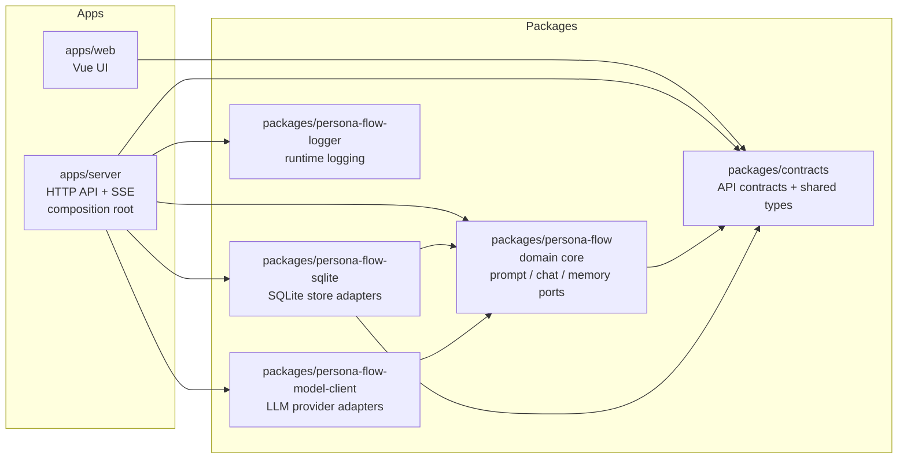

# ss.ai 项目地图

[English](project-map.md) | 简体中文 | [日本語](project-map.ja.md)

这份文档是 `ss.ai` 的维护者导向项目地图。
当你需要在冷启动状态下快速理解工作区结构、主聊天流程、运行时配置，以及当前由哪些文件控制行为时，应该先看这里。

如果你想先看功能概览、在线演示链接和更短的上手方式，请先看仓库根目录的 [README](../README.zh-CN.md)。

## 工作区目的

`ss.ai` 是一个围绕 LLM 驱动的角色对话与 TRPG 风格交互构建的 TypeScript 实验项目。它的核心是 `packages/persona-flow`：负责组装 prompt 上下文、渲染 prompt 模板、按不同 model-call purpose 选择模型、通过注入的客户端调用 LLM，并把生成出的 chat turn 通过注入的 stores 持久化。

它主要覆盖以下工程与产品能力：

- 使用 TypeScript 和 Node.js 做应用设计
- LLM API 集成
- 基于 SSE 的流式聊天
- prompt 组合与模板管理
- 以 structured output 为主、并保留 provider-neutral tool-call 抽象供未来 agent 工具复用的 turn event 设计
- 长期记忆保存链路，包括 candidate intake、memory staging、embedding、轻量去重、LLM consolidation judge、memory retained 和 decision audit
- 用 SQLite 持久化对话与角色数据
- 角色对话与 TRPG 风格交互设计
- LLM provider abstraction

现阶段它并不是一个面向通用场景的成熟 OSS 框架。
API 稳定性、后向兼容性、生产可用级别质量，以及持续的外部支持都不做保证。

## 工作区

仓库使用 `pnpm-workspace.yaml` 中定义的 pnpm workspace：

- `packages/*`
- `apps/*`

常用命令：

```bash
npm run setup
pnpm install
pnpm run dev:server
pnpm run dev:web
pnpm run build
pnpm run deploy:staging
pnpm run deploy:prod
pnpm run start:server:staging
pnpm run start:server:prod
pnpm run test
pnpm run prompt:debug -- --help
```

本地默认 HTTP 端口是 `8999`，定义在 `apps/server/config/config.default.json` 中。

## 安装与部署

首次初始化会安装并激活项目固定版本的 pnpm：

```bash
npm run setup
```

初始化后只使用 pnpm 命令：

```bash
pnpm install
pnpm run build:server
pnpm run build:web
pnpm run deploy:staging
pnpm run deploy:prod
pnpm run deploy:server:staging
pnpm run deploy:server:prod
pnpm run deploy:web:staging
pnpm run deploy:web:prod
```

部署输出根目录是 `.deploy-staging` 和 `.deploy-prod`。

每个部署目录都包含：

- `server`：Node.js 服务包，包含 `config/*` 和 `schemas/config.schema.json`
- `web`：由 `apps/web/dist` 构建出的静态资源

部署后的服务会从 server 包根目录读取配置资源：

- `.deploy-staging/server/config/config.default.json`
- `.deploy-staging/server/config/config.staging.json`
- `.deploy-staging/server/config/config.local.json.example`
- `.deploy-staging/server/schemas/config.schema.json`
- `.deploy-prod/server/config/config.default.json`
- `.deploy-prod/server/config/config.prod.json`
- `.deploy-prod/server/config/config.local.json.example`
- `.deploy-prod/server/schemas/config.schema.json`

Lightsail 部署还可以在 release activation 阶段创建 `server/config/config.local.json`。当前流程通过 CI secret `LIGHTSAIL_DEFAULT_API_KEY` 和 `scripts/activate-lightsail-release.mjs` 在目标主机上写入本机覆盖文件。

web 部署输出位于：

- `.deploy-staging/web/*`
- `.deploy-prod/web/*`

部署后的服务启动命令：

```bash
pnpm run start:server:staging
pnpm run start:server:prod
```

本地开发命令默认都从仓库根目录启动。也就是说，`pnpm run dev:server`、`pnpm run dev:web` 和 `pnpm run dev:qq-bot` 会把仓库根目录作为 `process.cwd()`，因此运行时文件会落到 `./.runtime/`。在部署布局下，`pnpm run start:server:staging`、`pnpm run start:server:prod` 或 `pnpm --dir ./.deploy-prod/server start` 会以 `.deploy-*/server` 作为工作目录，因此运行时文件会落在对应的 server 包目录中。

示例：

```bash
pnpm --filter @ss-ai/server start
pnpm --dir ./.deploy-prod/server start
```

如果你需要覆盖运行时文件根目录，可以设置 `RUNTIME_HOME`。

如果任意 workspace 包的依赖声明发生变化，包括 `dependencies`、`devDependencies`、`peerDependencies` 或 workspace links，请重新执行 `pnpm install`，以保持 `pnpm-lock.yaml` 和部署依赖图同步。

## 模块依赖关系图

这张图表示包之间的 import / build 依赖方向，不表示一次 HTTP 请求的运行时调用顺序。`apps/server` 是 composition root：它负责把领域包、持久化适配器、模型 provider 适配器、日志、运行时配置和 HTTP API 装配到一起。



- `packages/contracts` 是最低层共享类型 / API 契约层，被前端、服务端、领域层和部分适配层共同引用。
- `packages/persona-flow` 是尽量不绑定框架的领域层，定义 store/model/memory ports，并负责 prompt、chat turn 和 memory core 的编排。
- `packages/persona-flow-sqlite` 和 `packages/persona-flow-model-client` 是适配层：它们依赖领域层定义的端口，而不是让领域层反向依赖 SQLite 或 provider SDK。
- `apps/server` 负责依赖装配并暴露 HTTP / SSE API；`apps/web` 只依赖 contracts 和自己的 UI 状态。

## Packages

### `packages/persona-flow`

这是核心领域包，应尽量保持不依赖具体框架和持久化实现。

职责：

- 在 `src/stores/**` 中定义领域 store interfaces
- 定义 `AppStores`，作为应用层注入的聚合依赖边界
- 通过 `PromptContextBuilder` 从 stores 构建 prompt context
- 通过 `modelCallRegistry` 解析 model-call handlers
- 实现当前 `chat.main/single_character_chat` 的 prompt 组装和结构化事件输出流程
- 通过 `PersonaFlowChatTurnService` 负责编排 chat turn
- 通过 `ModelRuntime` 解析模型运行时并调用注入的 `ModelClient`
- 在 `src/llm/modelClient.ts` 中定义 LLM client interfaces，包括 provider-neutral tool definitions、tool choice 和可选 embedding 调用
- 定义 `submit_turn_events` 事件 schema，并解析模型返回的 turn events
- 在 `src/memory/**` 下定义长期记忆 pipeline：raw candidate records、memory staging records、memory retained records、consolidation decision records、ports、normalization、embedding、cosine similarity ranking、`MemoryCandidateRecorder`、`MemoryStagingProcessor`、`MemoryRetainedConsolidationProcessor` 以及 `MemoryPipelineService`
- 在 `src/memory/embedding/**` 下定义 `ModelClientMemoryEmbeddingProvider`，把 memory pipeline 的 embedding port 接到注入的 `ModelClient`，让 provider/runtime 依赖只出现在该 adapter 文件中而不会污染 stage 代码

层级关系需要特别注意：`PersonaFlowChatTurnService` 负责 turn 编排和持久化，但不直接解析 provider tool calls 或 structured output。已注册的 `ModelCall<TParsedOutput>` 负责本 purpose 的 prompt 组装、要求的输出格式（`structuredOutputSchema` 和/或 `tools`）、以及业务级解析。`ModelRuntime` 只负责 provider/model/API key 解析和调用 `ModelClient`，返回 provider-neutral 的原始 `llmResponse`（`output` / `structuredOutput` / `toolCalls`）。随后 model call 把响应转换为 `parsedOutput`；可选的 `parsedToolCalls` 只用于调用方确实需要检查的中间工具结果。对当前 `single_character_chat` 来说，最终可见回复使用 `response_format: json_schema` 生成，并折叠进 `parsedOutput` 的 `{ displayText, events }`。Memory write candidates 是同一个 structured output 中的顶层可选字段，会折叠进 `parsedOutput.memoryWriteCandidates` 供内部处理。

主聊天流程：

1. `PersonaFlowChatTurnService.chatTurn()` 接收 user、character、conversation 和 message 输入。
2. `prepareChatTurnContext()` 校验角色和会话、解析发送方 actor、按需追加用户消息，并构建 `PromptContext`。
3. `resolveModelCall()` 根据请求的 purpose 和 interaction mode 选择已注册 handler。目前实际使用的是 `chat.main:single_character_chat`。
4. handler 组装 LLM messages，并通过 `structuredOutputSchema`（基于 `submit_turn_events` 事件 schema 加上可选 `memoryWriteCandidates` 字段）要求模型以结构化 JSON 形式提交本回合事件。`ModelRuntime.chat()` 根据 `userPreferences.modelAssignments[modelCallPurpose]` 解析 provider / model，根据 provider credential 或默认 API key 解析密钥，然后调用 `ModelClient`。
5. model call 把返回的 `llmResponse.structuredOutput` 解析为 `SubmitTurnEventsArgs`，并返回 chat 专用的 `parsedOutput`：归一化后的展示文本和有序 `TurnEvent[]`。
6. model call 还会从 structured output 中提取 `memoryWriteCandidates`。assistant turn 持久化后，`PersonaFlowChatTurnService` 通过 `MemoryPipelineService.handleChatTurnCandidates()` 处理这些 candidates：service 内部按 `memory.enabled` 决定是否运行，然后顺序调用 `MemoryCandidateRecorder` 记录原始候选；当 `memory.candidateProcessingMode === "inline"` 且 `memory.staging.enabled` 时，再触发 `MemoryStagingProcessor` 完成规则过滤、normalization、embedding、memory staging 精确重复聚合和 candidate 状态更新。后续 retained consolidation processor 可以从 pending staging evidence 中检索相关 retained memories，调用 `memory.consolidate` 的 LLM judge，并由系统层应用 create / update / merge / ignore / archive 等决策。
7. `PersonaFlowChatTurnService` 只消费这个 parsed result，不需要知道底层输出格式。完整有序的 turn event 列表会随 assistant turn 一起持久化。
8. Assistant turn 会作为 conversation 的 self actor 写入 chat store，`appendAssistantTurn()` 同时写 timeline message 和结构化 `turn_events`。

`single_character_chat` 的 streaming 路径已经迁移到结构化输出：`/v1/chat/stream` 通过 `response_format: json_schema` 让 provider 按 token 流式返回 JSON 文本；`createSubmitTurnEventsPreviewParser` 增量解析这段 JSON，把 `replyText.text` 字符和已完结的事件对象作为 SSE `chunk` / `turnEventPreview` 推送给前端，最终 `done` 事件再回传完整 `TurnEvent[]`。

Memory candidate collection 不影响 streaming preview。流式文本和 `turnEventPreview` 事件仍然只来自 structured-output JSON 文本通道；memory candidates 只在模型 stream 完成后的最终 parsed structured output 中被消费。

Memory 保存链路已经覆盖 candidate -> staging -> retained：structured output 可以提交 `memoryWriteCandidates`，服务端会记录候选、生成 embedding、聚合 normalized text 完全相同的 staging evidence；retained consolidation 再把 staging evidence、相关 retained memories 和角色上下文交给 LLM judge，由系统层校验并写入长期 retained memories 与 consolidation decision audit。retained memories 还没有回读进 chat prompt，下一步会实现重要长期记忆注入、query 工具和前端 Memory Lab / 调校页面。详细边界、端口、数据表、配置和下一步工作见 [Project Map - Memory 子系统](project-map-memory.zh-CN.md)。

interaction modes 定义在 `@ss-ai/contracts` 中，整体架构也预期后续支持多个 mode。当前真正落地到运行时的只有 `single_character_chat`；其他 mode 虽然已经在 contracts 和 UI 中存在，作为后续规划的占位，但还没有接入 prompt 和 model-call dispatch。

### `packages/contracts`

前后端共享契约包。

职责：

- 通过 `ApiDefine` 定义 HTTP API
- 在 `src/apis/*.api.ts` 中定义请求和响应类型
- 定义 `INTERACTION_MODES`、`DEFAULT_INTERACTION_MODE` 和 `InteractionMode`
- 定义 `MODEL_CALL_PURPOSES`、`ModelCallPurpose` 以及模型分配相关类型
- 定义 `TurnEvent`、`SubmitTurnEventsArgs`、`MessageKind`，以及用于模型提交事件和落库读取校验的 Zod schemas
- 定义 `MemoryWriteCandidate`、memory scope/type 字面量，以及用于校验模型提交 memory write candidates 的 Zod schemas

模型调用配置使用 `MODEL_CALL_PURPOSES` / `ModelCallPurpose`，以及 `ModelAssignment` / `ModelAssignmentMap`。

Turn event 的纯类型与字面量常量位于 `packages/contracts/src/turnEvents.ts`；需要运行时校验的 Zod schema 位于 `packages/contracts/src/turnEvents.schema.ts`，通过 `@ss-ai/contracts/turnEvents.schema` 子入口使用。这样 web 可以引用纯 contracts 而不把 Zod 运行时代码打进主 bundle。

Memory candidate 的纯类型位于 `packages/contracts/src/memoryCandidates.ts`；运行时 Zod schema 位于 `packages/contracts/src/memoryCandidates.schema.ts`，通过 `@ss-ai/contracts/memoryCandidates.schema` 子入口使用。`SubmitTurnEventsArgs` 可以包含顶层 `memoryWriteCandidates`；当前 chat-turn wiring 会记录它们，按配置处理到 memory staging，并提供 candidates、memory staging、memory retained 的 debug API 契约。Consolidation decisions 已写入审计 store，trace / decision 查询体验会在 Memory Lab 中补齐。

### `packages/persona-flow-sqlite`

`AppStores` 的 SQLite 实现。

职责：

- 用 Drizzle 打开 `better-sqlite3` 数据库
- 在 `src/db/schema.ts` 中定义 schema
- 实现角色、会话、actors、messages、用户资料、偏好和 provider credentials 等 stores
- 实现 memory candidates、memory staging、memory staging sources、memory retained 和 memory consolidation decisions 的 SQLite stores
- 通过 `createSqliteStores()` 创建完整的 `AppStores`

重要数据表：

- `characters`
- `conversations`
- `conversation_actors`
- `messages`
- `turn_events`
- `user_profiles`
- `user_preferences`
- `user_character_states`
- `user_provider_credentials`
- `memory_candidates`
- `memory_staging`
- `memory_staging_sources`
- `memory_retained`
- `memory_consolidation_decisions`

`user_preferences.model_assignments_json` 用于保存从 model-call purpose 到 `{ provider, model }` 的映射。

`messages` 是会话 timeline/display 表，保存 `kind`、`display_text`、发送 actor、conversation id 和时间戳。assistant turn 使用 `kind = "assistant_turn_events"`。

`turn_events` 保存事件类输出折合后的有序事件 payload（历史上叫 `submit_turn_events`，现在以结构化输出提交）。每行属于一个 assistant message，并保存 `seq`、`type`、JSON payload、schema version 和时间戳。`SQLiteChatStore.appendAssistantTurn()` 会在同一个事务中写入 message 和 turn events；读取 recent messages 时会把 assistant message 的 `turnEvents` 重新组装出来。

### `packages/persona-flow-model-client`

模型供应商接入包。

职责：

- 实现 `persona-flow` 中定义的 `ModelClient` interface
- 由 `DefaultModelClient` 按 provider 分发
- 当前实际 provider 是通过 `MistralModelClient` 接入的 Mistral
- 支持普通生成、structured 输出（`response_format: json_schema`，同时适用于非流和流路径）、tool calls、模型列表获取，以及基于结构化输出文本通道的流式输出。对 structured stream，会先累积原始 JSON text 供 preview 使用，再把最终 parse 后的对象暴露为 `ModelStreamResult.structuredOutput`
- 在 `src/mistral/mistralToolAdapter.ts` 中把 provider-neutral `ModelToolDefinition` 转成 Mistral function tools（保留给未来查询类工具调用使用）

provider 列表和 API URL 来自 runtime config。API key 按用户和 provider 保存在 credential store 中。SQLite 目前仍然通过空实现的 encrypt/decrypt helpers 处理它们，因此落库值依然是明文，直到后续补上真正的加密方案。

### `packages/persona-flow-logger`

供 server 和 bot 运行时使用的小型文件 logger。

职责：

- 日志等级：`verbose`、`debug`、`info`、`warn`、`error`
- 可选源码位置与堆栈信息
- 全局 logger helpers

## Apps

### `apps/server`

Express HTTP 服务。

职责：

- 读取 `apps/server/config/config.default.json`、可选的 `apps/server/config/config.{APP_ENV}.json` 和可选的 `apps/server/config/config.local.json`
- 打开位于 `runtimeFiles.userDataDir/app.db` 的 SQLite 数据库
- 通过 `createSqliteStores` 创建 `AppStores`
- 注册 chat、user preferences、profiles、characters、conversations 和 conversation actors 的 HTTP 路由
- 在每次 chat 请求中创建 `PersonaFlowChatTurnService`，并注入 stores、logger、prompt logger 和 `DefaultModelClient`

重要行为：

- 当前应用实质上仍然接近单用户：除少数 chat 路径外，API 代码默认使用 `DEFAULT_USER_ID = "default"`
- 认证支持两种模式，通过 `config.auth.mode` 切换：`default-user` 和 `local-password`
- `default-user` 不做真实登录，所有请求都视为配置中的默认用户
- `local-password` 提供一个简单的用户名密码加 session-cookie 的认证流程
- `/v1/chat` 内部使用 `response_format: json_schema` 结构化输出，并返回统一的 `output + turnEvents` 聊天契约
- `/v1/chat/stream` 在 HTTP 层保持 SSE 响应形状，`single_character_chat` 现在会随 provider 的 structured-output 文本流逐 token 推送 `chunk` / `turnEventPreview`；最终 `done` 事件携带完整 `turnEvents`
- `/v1/chat/dry-run` 只组装 prompt messages，不做 LLM 调用，也不持久化
- prompt logs 由 `promptLog` 配置控制

### `apps/web`

Vue 3 + Vite 前端。

职责：

- 主界面是三栏布局：左侧工作区侧栏，中间聊天面板，右侧上下文检查器与设置面板
- 使用 `@ss-ai/contracts` 中的 API types 和 constants
- 允许用户配置 provider API keys 和 model assignments
- 发送 chat 请求、stream 请求、dry-run 请求和消息删除请求
- 从 `TurnEvent[]` 渲染 assistant 输出：`replyText` 渲染为文本段，`expression` 和 `sceneAtmosphere` 渲染为内联 marker chip，完整 `turnEvents` 仍保留在 debug block 中

重要 UI 状态：

- `src/shared/state/appState.ts` 中的 `contextVersion` 会在角色或会话上下文变化时触发聊天历史重载
- 当前激活的角色、会话和 actor 状态保存在各面板 view-model 模块中
- 聊天支持非 stream 和 stream UI 模式。两条路径在有 `turnEvents` 时都会优先从中推导显示内容。stream 模式会接收 structured-output JSON preview parser 发出的 token 级 `chunk`，通过一个小型 render queue 做平滑排队显示，并在 `turnEventPreview` 到达时插入内联 marker，最终再用 `done.turnEvents` 生成的 canonical `displaySegments` 对消息做一次权威校正

当前设置行为：

- `apps/web/src/panels/userPreference/useUserPreferenceViewModel.ts` 负责按 purpose 加载和保存 `modelAssignments`
- 对应 API endpoint 是 `/v1/user-preference/model-assignment`

### `apps/prompt-debug-cli`

用于 prompt 实验的 CLI。

职责：

- 读取 YAML prompt-debug 配置
- 渲染 Handlebars prompt templates
- 支持只渲染不调用模型，也支持直接调用配置好的模型
- 可以输出最终组装出来的 messages

示例：

```bash
pnpm run prompt:debug -- --config apps/prompt-debug-cli/examples/shishi-basic.yaml --render-only
```

### `apps/qq-bot`

QQ bot 集成。

职责：

- 接收 QQ 私聊和群消息
- 解析或创建服务端 conversation
- 调用 server chat API，并根据服务端返回结果记录回复或跳过回复

它依赖 HTTP server 先启动并完成配置。

## 运行时配置

配置加载逻辑实现在 `apps/server/src/util/config.ts` 中。

加载顺序：

1. `apps/server/config/config.default.json`
2. 如果设置了 `APP_ENV` 且文件存在，则加载 `apps/server/config/config.{APP_ENV}.json`
3. 如果存在，则加载 `apps/server/config/config.local.json`

合并后的配置会由 `apps/server/schemas/config.schema.json` 验证。

无论源码运行还是部署后运行，配置文件都会从 `apps/server/config` 或 `server/config` 读取。`logger.logFilePath`、`runtimeFiles.tempDir`、`runtimeFiles.userDataDir` 和 `promptLog.filePath` 这类相对运行时路径默认都从当前工作目录解析。如果需要覆盖，可以设置 `RUNTIME_HOME`。

`apps/server/config/config.local.json` 用于机器本地覆盖，不会提交到仓库。`apps/server/config/config.local.json.example` 是本地开发时可复制的模板。

在当前 Lightsail 部署流程中，`config.local.json` 不需要提前出现在 release archive 中。它可以在 release activation 阶段由服务器创建，并作为最高优先级的运行时覆盖配置。

当前已提交的环境覆盖配置位于 `apps/server/config/config.staging.json` 和 `apps/server/config/config.prod.json`。

`apps/qq-bot` 默认从 `apps/qq-bot/.env` 读取 bot 环境变量。若通过仓库根目录执行 `pnpm run dev:qq-bot`，其运行时输出也会落在仓库根目录的 `.runtime/` 下。

重要配置段：

- `http`：host 和 port
- `logger`：日志文件路径、等级、源码和堆栈开关
- `runtimeFiles`：临时目录和用户数据目录
- `agent`：模型客户端的超时和重试设置
- `promptLog`：prompt logging 是否启用以及输出路径
- `memory`：长期记忆写入链路开关、候选处理模式，以及 `memory.staging` / `memory.retained` 的运行时参数；memory 诊断日志复用全局 `logger.level`，详细说明见 [Project Map - Memory 子系统](project-map-memory.zh-CN.md)
- `models`：provider 配置、API URL、可选默认 API key、默认 model，以及可选静态 `availableModels`
- `defaultModelAssignments`：按 `ModelCallPurpose` 配置的默认 provider 和 model 映射
- `auth`：认证模式、默认用户 id、是否允许注册、session 生命周期和 cookie 设置

默认配置当前定义了 `mistral.ai` provider，以及对应的 Mistral API URL 和静态模型列表。

## 数据与 Actor 模型

会话并不是简单的 user / assistant 文本序列，而是显式区分 actors：

- `self`：在对话中回复的 AI 角色
- `other`：登录用户或本地 actor
- `system`：保留的系统 actor 角色

messages 保存 `senderActorId`、`conversationId`、`kind`、`displayText`、可选 `turnEvents` 和时间戳。prompt 渲染阶段会把 actors 映射到 LLM roles：

- `self` -> `assistant`
- `system` -> `system`
- 其他 actor -> `user`

`packages/persona-flow/src/prompt/speakerTag.ts` 中有共享的 speaker-tag helper，为未来更复杂的 interaction mode 预留。当前 `single_character_chat` prompt 路径不会给发往 LLM 的消息加 speaker tag。assistant 历史如果带有 `turnEvents`，当前只会把其中的 `replyText` 重新用于 prompt history；expression、scene atmosphere 等非文本事件会持久化下来，留给后续 prompt/state 设计使用。在输出归一化时，仍会移除 assistant 风格的名字前缀，避免回复里重复出现标签。

## 模型分配

模型分配是按用途管理的。共享标识定义在 `packages/contracts/src/modelCallPurpose.ts` 中。

当前用途：

- `chat.main`
- `memory.summarize`
- `memory.consolidate`
- `memory.embed`

当前 chat 路径调用模型时使用的 `modelCallPurpose` 是 `"chat.main"`。
Memory embedding adapter 在生成候选记忆向量时使用 `"memory.embed"`。
Memory retained consolidation judge 使用 `"memory.consolidate"`，在模型分配 UI 完整支持前可回退到 `"memory.summarize"` 的 assignment。

模型解析顺序是“用户优先，配置兜底”：

1. 用户自己的 model assignment
2. `defaultModelAssignments[modelCallPurpose]`
3. 报错

API key 的解析顺序同样是“用户优先，配置兜底”：

1. 用户自己的 provider credential
2. `models[provider].apiKey`
3. 报错

一次调用要成功，当前用户必须满足：

1. 在 user preferences 中为该 purpose 配置了 model assignment，或者运行时配置里有对应的 `defaultModelAssignments`
2. 为该 assignment 的 provider 配置了用户 credential，或者运行时配置中提供了默认 API key
3. 运行时配置中存在该 provider 的模型配置

## 关键文件

如果你要 review 或修改行为，建议先从这些文件开始：

- `packages/contracts/src/modelCallPurpose.ts`
- `packages/contracts/src/interactionMode.ts`
- `packages/contracts/src/memoryCandidates.ts`
- `packages/contracts/src/memoryCandidates.schema.ts`
- `packages/contracts/src/turnEvents.ts`
- `packages/contracts/src/turnEvents.schema.ts`
- `packages/contracts/src/apis/*.api.ts`
- `packages/persona-flow/src/chatTurn/chatTurnService.ts`
- `packages/persona-flow/src/chatTurn/chatTurnPreparation.ts`
- `packages/persona-flow/src/chatTurn/memoryCandidateLogger.ts`
- `packages/persona-flow/src/chatTurn/events/submitTurnEventsParser.ts`
- `packages/persona-flow/src/chatTurn/events/turnEventText.ts`
- `packages/persona-flow/src/memory/types.ts`
- `packages/persona-flow/src/memory/settings.ts`
- `packages/persona-flow/src/memory/MemoryPipelineService.ts`
- `packages/persona-flow/src/memory/createMemoryPipelineService.ts`
- `packages/persona-flow/src/memory/candidate/MemoryCandidateRecorder.ts`
- `packages/persona-flow/src/memory/candidate/candidatePorts.ts`
- `packages/persona-flow/src/memory/candidate/textNormalization.ts`
- `packages/persona-flow/src/memory/embedding/ModelClientMemoryEmbeddingProvider.ts`
- `packages/persona-flow/src/memory/embedding/MemoryEmbeddingStep.ts`
- `packages/persona-flow/src/memory/ranking/similarity.ts`
- `packages/persona-flow/src/memory/ranking/rankSimilarMemories.ts`
- `packages/persona-flow/src/memory/decision/decisionPolicy.ts`
- `packages/persona-flow/src/memory/staging/MemoryStagingProcessor.ts`
- `packages/persona-flow/src/memory/staging/memoryStagingPorts.ts`
- `packages/persona-flow/src/memory/staging/memoryStagingTypes.ts`
- `packages/persona-flow/src/memory/stores/memoryRetainedStorePort.ts`
- `packages/persona-flow/src/llm/tools/modelTool.ts`
- `packages/persona-flow/src/llm/tools/submitTurnEventsTool.ts`
- `packages/persona-flow/src/modelCall/modelRuntime.ts`
- `packages/persona-flow/src/modelCall/modelCallRegistry.ts`
- `packages/persona-flow/src/modelCall/chat.main/singleCharacterChat/singleCharacterChatCall.ts`
- `packages/persona-flow/src/modelCall/chat.main/singleCharacterChat/promptViewModel.ts`
- `packages/persona-flow/src/stores/appStores.ts`
- `packages/persona-flow-sqlite/src/db/schema.ts`
- `packages/persona-flow-sqlite/src/db/SQLiteMessageStore.ts`
- `packages/persona-flow-sqlite/src/db/CharacterDbRouter.ts`
- `packages/persona-flow-sqlite/src/createSqliteStores.ts`
- `packages/persona-flow-model-client/src/defaultModelClient.ts`
- `packages/persona-flow-model-client/src/mistral/mistralEmbed.ts`
- `packages/persona-flow-model-client/src/mistral/mistralModelClient.ts`
- `packages/persona-flow-model-client/src/mistral/mistralToolAdapter.ts`
- `apps/server/src/http/apis/chat/*.ts`
- `apps/server/src/http/apis/userPreference.route.ts`
- `apps/web/src/panels/chat/useChatViewModel.ts`
- `apps/web/src/panels/chat/turnEventDisplay.ts`
- `apps/web/src/panels/chat/chatTypes.ts`
- `apps/web/src/panels/userPreference/useUserPreferenceViewModel.ts`
- `docs/project-map-memory.zh-CN.md`
- `docs/plans/memory-write-implementation.md`
- `docs/plans/memory-write-followups.md`

## 当前维护备注

- `AI_FUNCTIONS` / `AiFunction` 到 `MODEL_CALL_PURPOSES` / `ModelCallPurpose` 的重命名已经在 contracts、web、server 和 store 层完成
- SQLite 中模型分配对应的列是 `model_assignments_json`，旧的 model-assignment 存储兼容逻辑已经移除
- 当前 single-character chat 模型输出路径使用 `response_format: json_schema` 结构化输出，负责 visible turn events 和可选 `memoryWriteCandidates`（事件 schema 来源仍是 `submitTurnEventsTool.argsSchema`）。这条路径不注册 memory candidate tool
- Chat-turn memory write 已经是持久化链路：candidates 从 structured output 中解析，assistant turn 持久化后通过 `MemoryPipelineService` 处理；服务端 runtime config 中的 `memory.enabled` 和 `memory.candidateProcessingMode` 控制 pipeline 是否运行以及是否 inline 处理
- Memory pipeline 内部包含 candidate recording、candidate -> memory staging processor、text normalization、embedding、normalized duplicate 聚合、similarity ranking、LLM consolidation judge、SQLite-backed `memory_candidates` / `memory_staging` / `memory_staging_sources` / `memory_retained` / `memory_consolidation_decisions` stores，以及 chat-turn integration
- Memory path 下一步：做前端 Memory Lab / 调校工具，支持 trace、manual candidate intake、processor controls 和 judge preview；随后把重要 retained memories 回读进 prompt，并提供 query 工具来支撑 agent loop
- 依赖 similarity thresholds 前 TODO：收集更多真实 `mistral-embed` 样本。当前 probe 返回 1024 维向量，并显示短中文用户事实可能有较高 baseline cosine similarity
- chatTurn/modelCall 的层级边界是刻意拆开的：chat service 消费 model call 的 `parsedOutput`，每个 model call 自己负责解析 provider response（structured output 或 tool arguments）。这样未来 interaction mode 即使用不同输出格式，也不需要改 chat-turn 持久化代码
- `messages` 现在是 timeline/display 表，结构化 assistant 事实存储在 `turn_events` 中
- Prompt history 当前只复用 assistant turn 里的 `replyText` events。TODO：等 prompt 格式和 UI 需求明确后，再把 expression、scene atmosphere 等非文本状态选择性注入 prompt
- SQLite credential store 已经预留 API key 加密钩子，但目前仍然是原样返回
- 低优先级 TODO：等部署与密钥管理方案明确后，把当前空实现的 API key encrypt/decrypt 替换成真正的静态加密方案
- `single_character_chat` streaming 现在随 provider 的 structured-output 文本流逐 token 推送；SSE `chunk` 由增量 JSON 预解析器从 `replyText.text` 中提取
- web 聊天 UI 会把 canonical `TurnEvent[]` 渲染成 `displaySegments`；stream 期间的文本和内联 marker 预览都只是推测性的，最终会由 `done.turnEvents` 覆盖校正
- 除 `single_character_chat` 之外的 interaction modes 虽然已经声明，但尚未接入运行时 model-call dispatch
- speaker-tag helper 和更丰富的多 actor prompt shaping 预留给后续 interaction modes；当前 `single_character_chat` 故意保持更简单的 prompt 路径
- TODO：web 组件里的 i18n 目前仍依赖共享的模块级 helpers；如果后续要支持 SSR、per-app i18n instance 或更严格的测试隔离，建议迁移为 `useI18n` 风格的 hook 或 provider

## 快速冒烟检查路径

常用检查：

```bash
pnpm run build
pnpm run test
pnpm run dev:server
pnpm run dev:web
```

HTTP health check：

```bash
curl http://127.0.0.1:8999/health
```

调试模型行为前，可以先用 dry-run 检查 prompt 组装：

```bash
curl -X POST http://127.0.0.1:8999/v1/chat/dry-run \
  -H "Content-Type: application/json" \
  -d '{"characterId":"<character-id>","conversationId":"<conversation-id>","userMessageText":"hello"}'
```
